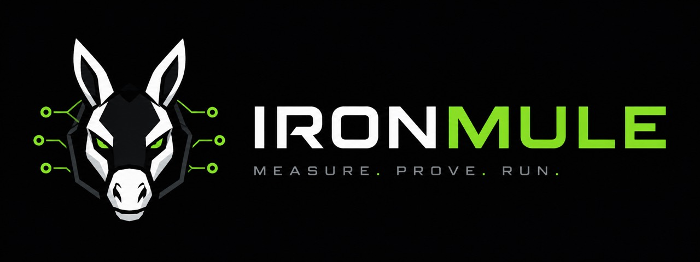

<div align="center">
  
  <p><strong>MEASURE&nbsp;&middot;&nbsp;PROVE&nbsp;&middot;&nbsp;RUN</strong></p>
</div>

# IronMule

IronMule is an adaptive MLX inference runtime for local LLMs on Apple Silicon. It measures optimizations on your Mac and only keeps them when they are faster and remain correct.

**Measured, not assumed.** IronMule makes the execution plan and service mode explicit, measures them on the current machine, and records the evidence rather than carrying an unverified speedup from another setup. It helps you measure local LLM inference on Apple Silicon, including MLX performance, KV cache reuse, time to first token (TTFT), and batching.

<p align="center">
  <a href="LICENSE.md"></a>
  <a href="https://www.python.org/"></a>
  <a href="https://github.com/ml-explore/mlx"></a>
</p>

IronMule is a local LLM inference runtime for [MLX](https://github.com/ml-explore/mlx) on Apple silicon. It includes prefix KV caching, grouped batch-1 execution, telemetry, and a correctness gate. It does not download or redistribute model weights.

> **Validity Domain — read before interpreting any number.** Every performance result below was measured on one `mlx-community/gemma-3-4b-it-4bit` model revision (`93724907`), 4-bit group-size 64 quantisation, MLX `0.32.0`, mlx_lm `0.31.3`, an Apple M1 Max with 32 GB unified memory on AC power, greedy decoding, contexts of 276–2048 tokens, batch 1 per execution, and up to 8 concurrent requests. Nothing outside this box is claimed. See [`docs/LIMITS.md`](docs/LIMITS.md).

## Key measured results

These are measured results, not promises for every Mac, model, workload, or MLX build. The conditions and raw evidence are in [`research/LEDGER.md`](research/LEDGER.md).

| Workload (E16, 40 independent OS processes) | Throughput | Median latency | Tail latency (p95) | Service TTFT |
| :-- | --: | --: | --: | --: |
| homogeneous | `+16.4 … +17.2%` | `+27%` | `−16%` | ~800 → ~87 ms |
| heterogeneous | `+15.6 … +15.8%` | `+27%` | `−15%` | ~800 → ~87 ms |
| staggered arrivals | `+15.1%` | `+26%` | `−8%` | ~690 → ~88 ms |

### How this scales to larger models

<picture>
  <source media="(prefers-color-scheme: dark)" srcset="docs/assets/model-scaling-dark.svg">
  
</picture>

The headline number does **not** carry unchanged to larger models. Measured on the same machine with an unchanged protocol, three runs each, the throughput gain falls from `+19.24%` at 4B to `+11.81%` at 27B — while the service TTFT improvement holds near `5x` and the median latency cost rises from `+48.6%` to `+60.1%`.

All three ran at a realised width of `4.00`, so group filling does not explain it. These runs are **exploratory**: no preregistration was sealed, so they carry less standing than the results above. Method, the full table and what to test next: [`docs/SCALING.md`](docs/SCALING.md).
| short answers | `+9.2%` | `+54%` | `−9%` | — |

Grouping does not make a request faster. It makes requests finish together: median latency worsens while tail latency and service TTFT improve. The short-answer result is included because the gain falls when groups do not fill. E16 reports zero correctness failures across 40 processes, while its frozen verdict remains `CONFOUNDED_BY_PROCESS_STATE`; both facts matter.

Prefix KV reuse was also measured within its declared execution plan. E10 measured a `−37.82%` end-to-end session result at a 66.8% shared prefix, and E12 measured TTFT ratios from `0.401` at prefix 276 to `0.094` at prefix 2048. Within the chunked plan, reuse was bit exact across 756 requests and 14,369 decode steps. These are separate workloads and are not interchangeable claims.

## Try it in under a minute

Requirements: Python 3.10+, an Apple silicon Mac, and a local MLX model snapshot.

### 1. Install

Install the published package with:

```bash
pip install ironmule
```

For a checkout and development tools (secondary path):

```bash
git clone https://github.com/Tobayko/IronMule.git
cd IronMule
python -m pip install -e ".[dev]"
```

IronMule does not ship or download model weights. Use a model snapshot whose terms permit your use.

### 2. Check your Mac

```bash
ironmule doctor
```

### 3. Run a benchmark

Run the local benchmark when a compatible model is available:

```bash
ironmule benchmark
```

The benchmark prints the baseline and IronMule measurements for the selected workload. It does not download a model.

### 4. Use from Python

```python
import ironmule

rt = ironmule.Runtime.load()  # interactive mode by default
result = rt.generate("Explain unified memory in two sentences.", max_tokens=96)
print(result.text, result.metrics["service_ttft_ms"])
```

See [`docs/RUNTIME.md`](docs/RUNTIME.md) for the API and [`research/LEDGER.md`](research/LEDGER.md) for reproducible experiment methods.

## What it does

**It refuses to guess.** Sixteen preregistered experiments decided what ships. Four optimisations that looked obvious were measured and dropped: speculative decoding (`2.9×` slower), projection fusion in decode (neutral), true tensor batching (changes tokens at batch 8), and a dispatch-overhead hypothesis that turned out to be wrong. The negative results remain in the ledger.

**It never changes your answer behind your back.** Two decisions stay with the caller because both alter observable behaviour:

| Decision | Options | What changes |
| :-- | :-- | :-- |
| Execution plan | `StrictOneShotPlan`, `ReusableSessionPlan` | which tokens come out |
| Service mode | `InteractiveMode`, `ThroughputMode` | the latency/throughput trade |

**It tells you what it cost.** Time to first token is reported from request arrival (`service_ttft_ms`) and from model start (`engine_ttft_ms`). Under concurrency those differ by queue wait, so both remain visible. Telemetry also records latency, inter-token timing, aggregate tokens per second, realised group width, peak memory, fallbacks, correctness errors, and plan-switch attempts.

## Reproduce the headline benchmark

The command used for the compact benchmark output is:

```bash
python -m ironmule.benchmark
```

The measured output recorded in the repository is:

```
mode              wall ms        tok/s  svcTTFT p50      lat p50      lat p95
interactive          3303         87.2       1384.9       1921.0       3367.8
throughput           2700        106.6        246.6       2893.8       3048.3

throughput gain +18.24%   identical answers in both modes: True
```

Replicate with warmup, repeated runs, and the same validity-domain fingerprint before comparing another machine. A single run is not evidence of a general performance result.

## Correctness

Twenty-eight tests cover exact token IDs, token counts, stop reasons, KV state hashes, ragged response lengths, early-finishing requests, reversed arrival order, heterogeneous prompt lengths, staggered arrival, group widths 1 to 4, sequential fallback, and the absence of state aliasing between requests.

```bash
pytest tests/test_ironmule_runtime.py -q              # fast, no model needed
pytest tests/test_ironmule_runtime_integration.py -q  # against a real model
```

A failed group restarts its requests from prefill and finishes them sequentially, discarding tokens the failed group produced rather than trusting them. That wastes work and is the choice that keeps output identical to a clean sequential run. It was verified on a real model with an injected device failure.

## Honest limits

The measured validity domain is narrow and stated in full in [`docs/LIMITS.md`](docs/LIMITS.md). Known gaps include ragged prompt lengths inside one group (untested), sustained load (untested), the quality bound of `1.14` accuracy points measured on a public benchmark the model may have been trained on, and retired kernel counts because MLX exposes no machine-readable dispatch counter. No absolute dispatch time is claimed.

The runtime deliberately has no adaptive controller, no true tensor batching, no speculative decoding, and no automatic plan selection. True tensor batching diverged at batch 8 in E14b; speculative decoding accepted `0.17` drafted tokens on average and was `2.9×` slower. A latency-sensitive single-request path should stay in `InteractiveMode`, and grouping helps only when requests are concurrent and groups fill.

## About this repository

IronMule was developed inside a private research project and is published here as a curated subset: runtime, examples, tests, and the experiment ledger that backs every number. Local paths, personal identifiers, model weights, and third-party datasets are not included; SQuAD is fetched by a script under its own terms rather than redistributed.

Community benchmark submissions are welcome. Use the [benchmark issue template](.github/ISSUE_TEMPLATE/benchmark_submission.md) and see [`COMMUNITY_BENCHMARKS.md`](COMMUNITY_BENCHMARKS.md) for the required fields.

## Layout

| Path | Purpose |
| :-- | :-- |
| `ironmule/` | Runtime: plans, modes, executors, telemetry, fingerprint, autotuner |
| `examples/` | Interactive chat, throughput service, reusable session |
| `tests/` | Fast scripted-backend tests and real-model integration tests |
| `research/LEDGER.md` | Every experiment, positive and negative, with method and raw data |
| `research/raw/` | Preregistrations and result summaries |
| [`docs/RUNTIME.md`](docs/RUNTIME.md) | Technical API and runtime documentation |
| [`docs/LIMITS.md`](docs/LIMITS.md) | Validity domain and known gaps |
| [`docs/SCALING.md`](docs/SCALING.md) | How the gain scales with model size, and what to test next |

## Licence and commercial use

IronMule is **fair-code** under the [IronMule Licence](LICENSE.md): source-available, not OSI open source. The licence carries a plain-language summary and clarifications so you can identify the permitted use before adopting it.

| Use | Terms |
| :-- | :-- |
| Personal, hobby, learning | **free** |
| Research, teaching, academic publication, benchmarking | **free** |
| Small organisation in production — under 10 people **and** ≤ EUR 1M turnover | **free** |
| Larger company, evaluation outside production | **free for 90 days** |
| Larger company, production use | commercial licence required |
| Hosted/managed service, resale, or embedding in a product you sell | commercial licence required |

Individuals, learning, and academic work never pay, at any scale. Commercial licences are priced by the licensee's annual turnover, starting at EUR 1,500 per year for the whole organisation. See [`COMMERCIAL.md`](COMMERCIAL.md) for the price bands, definitions and licensing details. IronMule does not redistribute model weights; the model you point it at carries its own terms.
