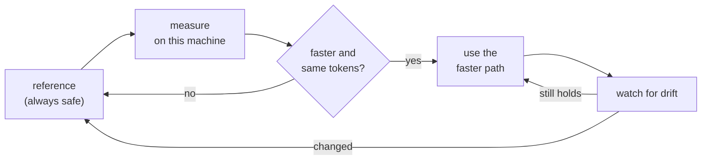

<div align="center">

  

  <h1>IronMule</h1>

  <p><strong>Local LLM inference on Apple Silicon and NVIDIA — up to 1.8× faster,<br>
  with byte-identical output.</strong></p>

  <p>
    <a href="https://github.com/Tobayko/IronMule/actions/workflows/ci.yml"></a>
    
    <a href="LICENSE.md"></a>
  </p>

  <p>
    
    
    
    
  </p>

  <p>
    <a href="#how-much-faster"><strong>Benchmarks</strong></a> ·
    <a href="#quick-start"><strong>Quick start</strong></a> ·
    <a href="#how-it-works"><strong>How it works</strong></a> ·
    <a href="docs/HTTP.md"><strong>HTTP API</strong></a> ·
    <a href="docs/LIMITS.md"><strong>Limits</strong></a>
  </p>

</div>

---

## What is IronMule?

**IronMule is an open-source local LLM inference runtime and OpenAI-compatible server for
Apple Silicon Macs (Metal) and Linux machines with an NVIDIA GPU (CUDA).** It runs on top
of [MLX](https://github.com/ml-explore/mlx) and serves models such as Gemma 3 fully
offline, on your own hardware.

It makes inference faster by choosing a better way to run the same model — reusing work,
skipping work that is not needed, and grouping requests — **without changing the output**.
Every speed-up has to prove on your machine that it returns the same tokens as the plain
reference path. If it cannot prove that, IronMule simply uses the reference.

- **Up to +82% faster** (1.82× on Gemma 3 1B, NVIDIA T4) and **+61%** on the same model on
  an M1 Max — every token identical to the reference. [All numbers](#how-much-faster).
- **Same answers, or no speed-up:** each optimisation is checked token by token before it
  is ever used.
- **Private by default:** fully offline. No prompts leave the machine, no model is
  downloaded unless you ask for it.
- **Drop-in:** an OpenAI-compatible HTTP server (`/v1/chat/completions`, streaming) and a
  three-line Python API.
- **Honest:** every number here comes from a committed measurement, including the ones
  that failed.

## How much faster?

<picture>
  <source media="(prefers-color-scheme: dark)" srcset="docs/assets/cross-platform-speedup-dark.svg">
  
</picture>

Same model, same prompts, greedy decoding, each device against its own stock MLX
reference — **higher is faster**.

| Model (4-bit) | Apple M1 Max | NVIDIA Tesla T4 | T4, opt-in `--compute-dtype float32` |
| :-- | --: | --: | --: |
| Gemma 3 1B | **1.61× · +61%** | **1.82× · +82%** | — |
| Gemma 3 4B | **1.27× · +27%** | 1.05× · +5% | **1.91× · +91%** |
| Gemma 3 12B | **1.11× · +11%** | 1.03× · +3% | **2.04× · +104%** |

Every run in the first two columns returned the same tokens as its reference — the
speed-up costs nothing in output. As wall-time ratios, which is how the raw data records
them: 0.623, 0.787 and 0.898 on the M1 Max, 0.550, 0.951 and 0.974 on the T4.

**The float32 column is a plan you switch on yourself.** Older NVIDIA GPUs (below compute
capability 8) have no native bf16, so MLX emulates it — badly enough that 4B and 12B barely
move otherwise. `--compute-dtype float32` computes the same weights in float32 instead:
about twice as fast on the T4, with a perplexity that matches float32 on Apple Silicon to
within 0.0001 nats per text chunk. Because it changes the output relative to bf16, IronMule
never turns it on by itself; `ironmule doctor` recommends it where it pays.

### Where the speed comes from

<picture>
  <source media="(prefers-color-scheme: dark)" srcset="docs/assets/headline-ratios-dark.svg">
  
</picture>

Individual optimisations on the M1 Max with Gemma 3 4B, each against an A/A control that
measures the machine's own noise (1.0028, so anything inside ±0.6% is not a result):

| Optimisation | Measured ratio | In plain terms |
| :-- | --: | :-- |
| Head-skip prefill | 0.846 | prompt processing **+18% faster** |
| Prefix cache, warm | 0.622 | repeated questions on one document **+61% faster** |
| Prefix cache, cold | 0.621 | **+61%**, even on the first session |

<details>
<summary>Two more figures: every session, and where prefill time actually goes</summary>

<picture>
  <source media="(prefers-color-scheme: dark)" srcset="docs/assets/session-ratios-dark.svg">
  
</picture>

<picture>
  <source media="(prefers-color-scheme: dark)" srcset="docs/assets/prefill-phases-dark.svg">
  
</picture>

</details>

Every figure on this page is rendered from committed measurement data by
`tools/make_figures.py`, and CI fails if a figure stops matching the data behind it.

> [!IMPORTANT]
> These numbers were measured on one Apple M1 Max (32 GB) and one Kaggle Tesla T4. They
> are not a promise for every machine or model. Run `ironmule benchmark` on yours. Details:
> [research/LEDGER.md](research/LEDGER.md) (entries `PORT1`, `B39d`, `E16`) and
> [docs/LIMITS.md](docs/LIMITS.md).

## Quick start

### 1. Install

You need Python 3.10 or newer. The package is installed from this repository.

```bash
git clone https://github.com/Tobayko/IronMule.git
cd IronMule
python -m venv .venv && source .venv/bin/activate

pip install -e .            # Apple Silicon Mac
pip install -e ".[cuda]"    # Linux with an NVIDIA GPU
```

### 2. Check your machine

```bash
ironmule doctor
```

```text
IronMule doctor
[OK] Apple Silicon architecture: arm64 (Apple M1 Max)
[OK] macOS: Darwin
[OK] Python: 3.12.13 (requires >= 3.10)
[OK] MLX: 0.32.0; importable (isolated probe)
[OK] MLX-LM: 0.31.3; importable (isolated probe)
[OK] NumPy: 2.5.2; importable (isolated probe)
[OK] MLX Metal device: Metal GPU operation verified

All runtime prerequisites are available.
```

On Linux the same command checks for an MLX CUDA device instead.

### 3. Get a model and start the server

```bash
ironmule setup --mode desktop
ironmule models list
ironmule models add mlx-community/gemma-3-1b-it-4bit --download
ironmule serve --model mlx-community/gemma-3-1b-it-4bit
```

The server listens on `http://127.0.0.1:8080` and speaks the OpenAI chat API:

```bash
curl http://127.0.0.1:8080/v1/chat/completions \
  -H "Content-Type: application/json" \
  -d '{"model": "mlx-community/gemma-3-1b-it-4bit",
       "messages": [{"role": "user", "content": "Hello!"}]}'
```

Add `"stream": true` for streamed tokens. Routes, authentication and TLS are described in
[docs/HTTP.md](docs/HTTP.md) and [docs/PRODUCT_QUICKSTART.md](docs/PRODUCT_QUICKSTART.md).

### 4. Or use it from Python

```python
import ironmule

runtime = ironmule.Runtime.load(model_id="mlx-community/gemma-3-4b-it-4bit")
result = runtime.generate("Explain unified memory in two short sentences.", max_tokens=96)

print(result.text)
```

`Runtime.load` uses a model that is already in your Hugging Face cache
(`hf download mlx-community/gemma-3-4b-it-4bit`). More in [docs/RUNTIME.md](docs/RUNTIME.md).

## Choosing a mode

| Your situation | Use | What you get |
| :-- | :-- | :-- |
| One chat, fastest reply | `InteractiveMode` (default) | Lowest latency per request |
| Several requests at once | `ThroughputMode` | More tokens per second in total |
| Many questions about one document | `ReusableSessionPlan` | The shared prompt is computed once |
| Older NVIDIA GPU (Turing, Volta) | `--compute-dtype float32` | About 2× faster on 4B and 12B, [see above](#how-much-faster) |

`ironmule tune` measures the available optimisations on your machine and keeps only the
ones that are faster **and** produce identical tokens.

## How it works

A fresh install knows nothing about your hardware and serves the reference path. From
there IronMule learns what your machine has actually earned:



The main techniques:

- **Grouped execution** — several requests share the time the GPU would otherwise wait.
- **Head skip** — the prompt is processed without computing output logits it never uses.
- **Prefix reuse** — a shared document prefix is computed once and reused bit-exactly.
- **Fixed compiled cache** — fewer, larger GPU kernels per token.
- **Hardware awareness** — per-device settings, for example larger CUDA graphs on older
  NVIDIA GPUs.

Anything that could change the output (a different numeric precision, sampling, true
tensor batching) is never chosen automatically.

## Commands

| Command | What it does |
| :-- | :-- |
| `ironmule doctor` | Check Python, MLX and the GPU (Metal or CUDA) |
| `ironmule setup` | Create local settings |
| `ironmule models` | List and register cached models |
| `ironmule serve` | Start the OpenAI-compatible server |
| `ironmule benchmark` | Compare interactive and throughput mode on your machine |
| `ironmule tune` | Find the fastest token-identical settings for a model |
| `ironmule revalidate` | Check that a stored tuning result still holds |
| `ironmule optimize` | Run a bounded, paced calibration and show its history |
| `ironmule status` | Show hardware and tuning status |
| `ironmule info` | Show package information |

Run `ironmule <command> --help` for all options.

## Limits

- Decoding is greedy; `temperature` and `top_p` are accepted and ignored.
- Concurrent requests to the server queue in arrival order.
- Model weights are never bundled or redistributed.
- Measured on Gemma 3 (4-bit); other models work through MLX-LM but carry no speed claim.
- Some research features are Apple-only (Metal kernels, macOS process guards) and are
  refused or skipped on CUDA.

The full validity domain is in [docs/LIMITS.md](docs/LIMITS.md). Ideas that were measured
and rejected stay documented in [docs/BACKLOG.md](docs/BACKLOG.md).

## Contributing

Contributions are welcome — see [CONTRIBUTING.md](CONTRIBUTING.md). A performance claim
needs a measurement; community benchmark results use the fields in
[docs/COMMUNITY_BENCHMARKS.md](docs/COMMUNITY_BENCHMARKS.md). Also:
[code of conduct](CODE_OF_CONDUCT.md) and [security policy](SECURITY.md) — report a
vulnerability privately, never in an issue.

```bash
pip install -e ".[dev]"
pytest tests/engine -m "not integration"
```

This repository also contains **Project Friday**, the research behind the numbers: every
study with its preregistration, raw data and the experiments that failed. Start at
[docs/README_PROJECT_FRIDAY.md](docs/README_PROJECT_FRIDAY.md).

## License

IronMule is open source under the [Apache License 2.0](LICENSE.md). You can use, modify and
distribute it, including in commercial products.

<div align="center">
  <br>
  <strong>Faster local inference, or your tokens back.</strong><br>
  <sub>If IronMule saved you time on your own machine, a star helps the next person find
  it — and a <a href="docs/COMMUNITY_BENCHMARKS.md">benchmark from your hardware</a> helps
  even more.</sub>
</div>
