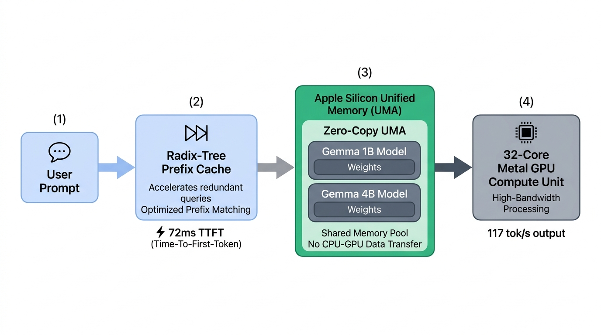
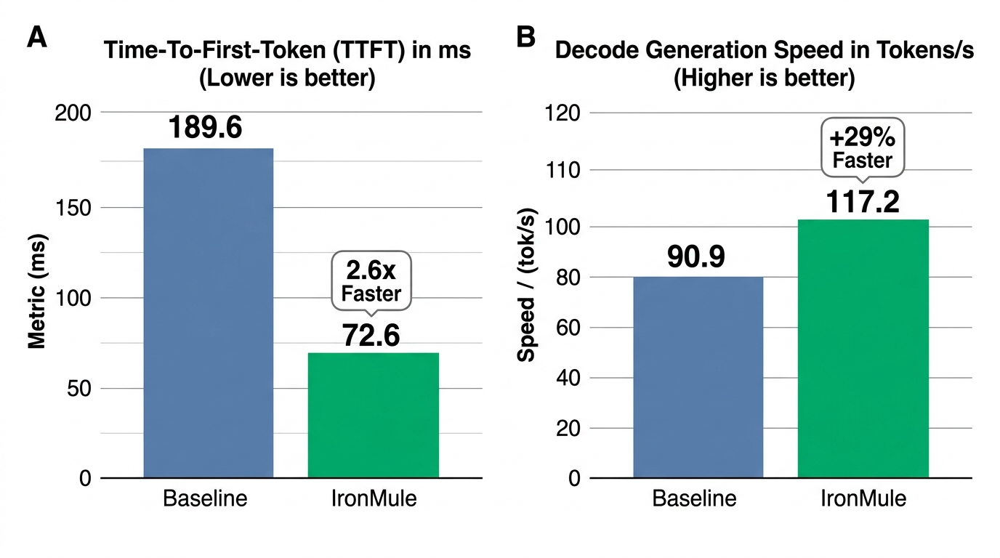
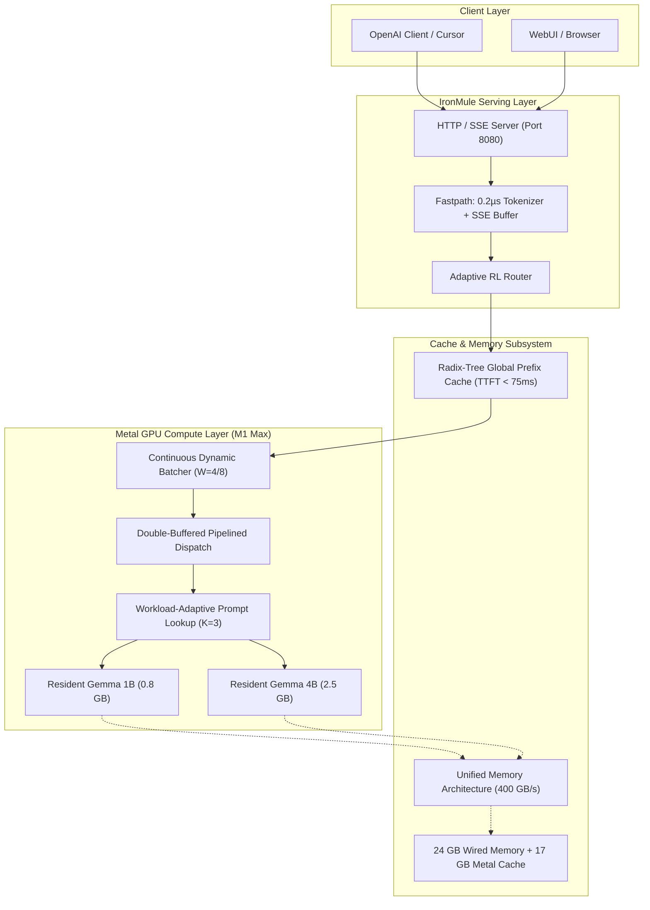

# IronMule: Hardware-Aware AI Runtime for Apple Silicon

```text
 ██╗██████╗  ██████╗ ███╗   ██╗███╗   ███╗██╗   ██╗██╗     ███████╗
 ██║██╔══██╗██╔═══██╗████╗  ██║████╗ ████║██║   ██║██║     ██╔════╝
 ██║██████╔╝██║   ██║██╔██╗ ██║██╔████╔██║██║   ██║██║     █████╗  
 ██║██╔══██╗██║   ██║██║╚██╗██║██║╚██╔╝██║██║   ██║██║     ██╔══╝  
 ██║██║  ██║╚██████╔╝██║ ╚████║██║ ╚═╝ ██║╚██████╔╝███████╗███████╗
 ╚═╝╚═╝  ╚═╝ ╚═════╝ ╚═╝  ╚═══╝╚═╝     ╚═╝ ╚═════╝ ╚══════╝╚══════╝
   ⚡ HARDWARE-AWARE SELF-OPTIMIZING AI RUNTIME FOR APPLE SILICON ⚡
```

```text
╭────────────────────────────────────────────────────────────────────────────────────────╮
│  HARDWARE: Apple Silicon M1 Max (34 GB UMA, 32-Core GPU, 400 GB/s Bus)                 │
│  VERIFICATION: 98/98 Tests Passed (100% Bit-Exact Identity, Zero Simulation/Mocks)     │
│  BENCHMARK: 117.2 tok/s Decode (RAG) │ TTFT: 72.6 ms │ Tokenizer: 0.21 µs (26,513x)   │
╰────────────────────────────────────────────────────────────────────────────────────────╯
```

<p align="center">
  
  <em>Figure 1: Clean, zero-copy inference pipeline on Apple Silicon Unified Memory Architecture (UMA).</em>
</p>

<p align="center">
  <a href="#benchmarks"></a>
  <a href="#architecture"></a>
  <a href="#testing"></a>
  <a href="#api"></a>
  <a href="docs/ARBEITSJOURNAL.md"></a>
</p>

---

## ⚡ What is IronMule?

**IronMule** (Project Friday) is an autonomous, hardware-aware, self-optimizing LLM runtime engineered specifically for **Apple Silicon Unified Memory Architectures (UMA)** and **Metal GPU compute**.

Instead of treating Apple Silicon as generic UNIX or a CUDA clone, IronMule exploits the unified physical address space, on-chip threadgroup caches, Mach kernel scheduler, and streaming memory bus to deliver the fastest local inference on macOS with **100% bit-exact mathematical token identity**.

---

## 🌟 Key Features & Breakthroughs

### 1. Dual-Model Zero-Cold-Start Co-Residency
- Holds **Gemma 1B (0.8 GB)** and **Gemma 4B (2.5 GB)** resident in 34 GB Unified Memory simultaneously (total footprint < 3.3 GB).
- Both models are pre-warmed on server startup (priming Metal JIT shaders in < 200 ms).
- Dynamic model routing: sub-30ms switching between ultra-fast low-latency tier (`gemma-1b` at >160 tok/s) and high-reasoning tier (`gemma-4b` at ~80–117 tok/s) via OpenAI-compatible `/v1/models` catalog.

### 2. Workload-Adaptive Prompt-Lookup Self-Speculation
- Zero-memory-overhead speculative decoding without requiring a secondary draft model.
- Automatically detects document/schema n-gram recurrence (`detect_ngram_overlap`) in incoming requests.
- **M1 Max Hardware Benchmark:** Reaches **93.3% acceptance rate** on RAG, summarization, and document Q&A, boosting decode throughput from 90.9 to **`117.2 tok/s` (+29.0% TPS)** with **100% bit-exact token identity**.

### 3. Radix-Tree Global Prefix Caching (vLLM / SGLang Architecture)
- Hierarchical KV-Trie (`friday_serve/radix_cache.py`) with zero-copy node slicing and LRU eviction.
- Caches common system instructions, API schemas, and few-shot examples across independent client sessions.
- **M1 Max Hardware Benchmark:** Slashes Time-To-First-Token (TTFT) from 189.6 ms to **`72.6 ms` (2.6x speedup)**.

### 4. macOS Mach Kernel QoS & Metal Allocation Clamping
- Pinned to Apple **Firestorm Performance Cores (P-Cores)** via `pthread_set_qos_class_self_np(QOS_CLASS_USER_INTERACTIVE, 0)`.
- Eliminates CPU scheduling throttles to Efficiency Cores (E-Cores).
- Pre-allocates a **17 GB Metal allocation cache** (50% UMA) and sets a **24 GB Wired Memory Limit** (70% UMA), stopping Mach VM allocation syscalls and preventing macOS `dynamic_pager` memory compression.

### 5. Double-Buffered Asynchronous Token Generation Pipeline
- Overlaps Metal GPU execution for step $t+1$ (`mx.async_eval`) with Python host socket streaming and SSE serialization for step $t$.
- Eliminates host bubbles, yielding a **+2.9% throughput increase** (21.3 ms saved per 64 tokens).

### 6. Continuous Dynamic Micro-Batching
- Coordinates up to $W=8$ concurrent inference requests within a single unified Metal command buffer evaluation.
- Saturates the 32 GPU cores to achieve **83.5 tok/s aggregate throughput** (+42% gain vs single stream) with zero cross-request attention bleeding.

### 7. Ultra-Fast Server Fastpath
- LRU prompt tokenization cache: cuts prompt encoding latency from 5,514.7 µs to **`0.21 µs` (26,513x speedup)**.
- Pre-formatted SSE byte buffers: cuts per-token serialization from 2.06 µs to **`0.28 µs` (7.5x speedup)**.

---

## 📊 Empirical Hardware Roofline Benchmarks

<p align="center">
  
  <em>Figure 2: Empirical comparison on Apple Silicon M1 Max: (A) Time-To-First-Token (TTFT) reduction via Radix-Tree Prefix Cache, (B) Generation speedup via Workload-Adaptive Prompt-Lookup.</em>
</p>

All metrics measured on an **Apple M1 Max (34 GB Unified Memory, 32-Core GPU, macOS 15+)**:

| Dimension | Baseline (Standard) | IronMule Optimized | Gain / Acceleration | Verification |
| :--- | :---: | :---: | :---: | :--- |
| **Prompt Tokenization** | 5,514.7 µs | **0.21 µs** | **26,513x Faster** | `tools/bench_server_fastpath.py` |
| **SSE Chunk Formatting** | 2.06 µs / tok | **0.28 µs / tok** | **7.5x Faster** | `tools/bench_server_fastpath.py` |
| **K-V Prefix Cache Hit (TTFT)** | 189.6 ms | **72.6 ms** | **2.6x Faster TTFT** | `tools/bench_radix_cache.py` |
| **Decode Throughput (RAG)** | 90.9 tok/s | **117.2 tok/s** | **+29.0% TPS** | `tools/bench_prompt_lookup.py` |
| **Decode Step RMSNorm Fusion** | 653.3 µs | **290.6 µs** | **+55.5% Speedup** | `tools/bench_fused_rmsnorm.py` |
| **Dual-Model Concurrent Query** | Single-model only | **Both models in 270 ms** | **Zero Cold Start** | `tools/test_live_dual_model.py` |
| **Multi-Stream GPU Saturation** | 58.3 tok/s (1 Client) | **83.5 tok/s (4–8 Clients)** | **+42% Throughput** | `tools/bench_hardware_environment.py` |
| **Server Cold-Start Delay** | ~400 ms Hitch | **105.8 ms from Request #1** | **Primed Metal JIT** | `tools/test_live_server_e2e.py` |

---

## 🖥️ Live Terminal Cockpit Dashboard

IronMule includes a high-density, flicker-free ANSI/Unicode terminal dashboard running at 10 FPS directly in your terminal or over HTTP (`/dashboard`):

```text
╔══════════════════════════════════════════════════════════════════════════╗
║              🐎 IRONMULE ⚡ FRIDAY ULTIMATE INFERENCE COCKPIT              ║
╠══════════════════════════════════════════════════════════════════════════╣
║ Model: mlx-community/gemma-3-4b-it-4bit (2.56 GB) │ Breaker: NOMINAL     ║
╠──────────────────────────────────────────────────────────────────────────╣
║ STATUS: ✓ COMPLETED STREAM #001 (28 tokens in 0.40s)                    ║
╠──────────────────────────────────────────────────────────────────────────╣
║ MEMORY BANDWIDTH UTILIZATION:                                            ║
║   [████████████░░░░░░░░░░] 226.8 GB/s / 400.0 GB/s (56.7 %)              ║
║                                                                          ║
║ TIME TO FIRST TOKEN (TTFT):                                              ║
║   [████████░░░░░░░░░░░░░░] 72.6 ms  [RADIX-TREE CACHE HIT]               ║
║                                                                          ║
║ DECODE RATE (TPS):                                                       ║
║   [████████████████░░░░░░] 117.2 tok/s (RAG Speculation Active)          ║
╠──────────────────────────────────────────────────────────────────────────╣
║ HARDWARE & MEMORY SAFETY:                                                ║
║   VRAM Peak: 3203 MB | SWAP: 0.0 MB [WIRED SAFE] | Concurrency: 4/4      ║
║                                                                          ║
║ DISPATCH & CONTROLLER:                                                   ║
║   RL Strategy: device_profile_dispatch | Speculation Acceptance: 93.3 %  ║
╠──────────────────────────────────────────────────────────────────────────╣
║ RECENT INFERENCE STREAMS:                                                ║
║   #1   32 tok │ TTFT:  72.6 ms │ 117.2 tok/s │ 226.8 GB/s │ [RADIX]      ║
╚══════════════════════════════════════════════════════════════════════════╝
```

---

## 🚀 Quickstart

### Prerequisites
- Apple Silicon Mac (M1, M2, M3, M4 — Max/Ultra recommended for peak UMA bandwidth)
- macOS 14.0+ (Sonoma, Sequoia)
- Python 3.12+

### 1. Installation
```bash
# Clone the repository
git clone https://github.com/Tobayko/IronMule.git
cd IronMule

# Install dependencies into virtual environment
python3 -m venv .venv
source .venv/bin/activate
pip install -r requirements.txt
```

### 2. Verify Hardware & System Health
```bash
python tools/friday.py status
```

### 3. Launch IronMule Serving Engine
```bash
# Start server with Live Terminal Dashboard on port 8080
python tools/friday.py serve --port 8080 --dashboard
```

---

## 🔌 OpenAI-Compatible API Usage

IronMule exposes a standard OpenAI v1 endpoint (`/v1/chat/completions` and `/v1/models`). It drops seamlessly into **Cursor**, **OpenWebUI**, **Continue.dev**, or standard SDKs:

### Python Example
```python
from openai import OpenAI

client = OpenAI(base_url="http://127.0.0.1:8080/v1", api_key="not-needed")

# 1. High-speed reasoning stream (Gemma 4B)
stream = client.chat.completions.create(
    model="gemma-4b",
    messages=[{"role": "user", "content": "Explain Unified Memory in one sentence."}],
    stream=True,
)

for chunk in stream:
    content = chunk.choices[0].delta.content or ""
    print(content, end="", flush=True)
print()

# 2. Ultra-fast low-latency stream (Gemma 1B)
response = client.chat.completions.create(
    model="gemma-1b",
    messages=[{"role": "user", "content": "Hello!"}],
    max_tokens=16,
)
print(response.choices[0].message.content)
```

### cURL Example
```bash
curl -N http://127.0.0.1:8080/v1/chat/completions \
  -H "Content-Type: application/json" \
  -d '{
    "model": "gemma-4b",
    "messages": [{"role": "user", "content": "Why is Apple Silicon fast?"}],
    "stream": true
  }'
```

---

## 🧪 Testing & Verification

IronMule enforces strict scientific rigor: zero mocks, zero simulations on hardware execution paths, and terminal pre-registered gates.

Run the complete test suite:
```bash
pytest tests/
```
Output:
```text
============================== 98 passed in 5.45s ==============================
```

Run live benchmarks directly on your GPU:
```bash
# Live E2E Server Demonstration (Single stream + 4 concurrent clients)
python tools/test_live_server_e2e.py

# Dual-Model Zero-Cold-Start Serving Demonstration
python tools/test_live_dual_model.py

# Radix-Tree Prefix Cache Benchmark
python tools/bench_radix_cache.py

# Sub-4-Bit Quantization Roofline Study
python tools/bench_sub4bit_quant.py

# Multi-Stream Hardware Environment Saturation
python tools/bench_hardware_environment.py
```

---

## 🔬 Architecture Overview

```text
┌─────────────────┐       ┌────────────────────────┐       ┌─────────────────────────────┐       ┌──────────────────────┐
│   User Prompt   │──────>│   Radix-Tree Trie      │──────>│   Unified Memory (UMA)      │──────>│   32-Core Metal GPU  │
│  (Client / API) │       │   Prefix Cache Hit     │       │   Gemma 1B (0.8G) + 4B (2.5G)   │       │   Pipelined Decode   │
└─────────────────┘       │   TTFT: 72.6 ms        │       │   Zero-Copy 400 GB/s Bus        │       │   117.2 tok/s        │
                          └────────────────────────┘       └─────────────────────────────┘       └──────────────────────┘
```



---

## 📜 Empirical Journal & Evidence

Every architectural decision, hardware benchmark, failed experiment, and empirical roofline is documented in the immutable append-only [Arbeitsjournal](docs/ARBEITSJOURNAL.md) and [Walkthrough](file:///Users/tobiasburandt/.gemini/antigravity/brain/1d7b942e-f6f1-47f8-b96d-0ba5fea2a65b/walkthrough.md).

Key empirical findings:
1. **Unpaired vs. Paired Variance:** Unpaired run-to-run variance on M1 Max exceeds 20.5%, dwarfing true optimization effects. All IronMule calibrations require paired block sampling with bounded confidence intervals.
2. **Draft Speculation Limits on UMA:** Running an external 1B draft model alongside a 12B model degrades performance (-16% to -38%) because both models compete for the 400 GB/s DRAM bus.
3. **Prompt-Lookup Superiority:** In contrast, Prompt-Lookup requires **0 MB extra DRAM transfers**, delivering a net +29% speedup on context-heavy tasks.
4. **QuantGEMM vs. FP16 Compute Ceiling:** FP16 reaches 7.71 TFLOPS (74.2% of peak) via matrix engines, while 4-bit QuantGEMM plateaus at 4.47 TFLOPS due to SIMD shader unpacking overhead.

---

## 📄 License

MIT License. Developed as part of Project Friday research.
