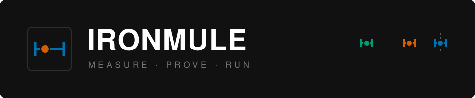
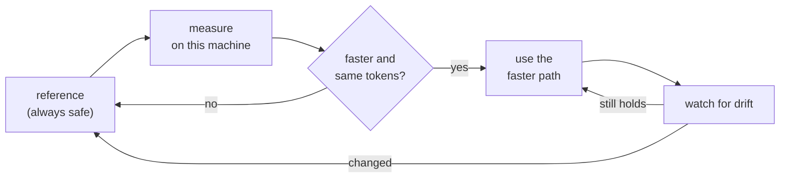

<div align="center">

  

  <br><br>

  

  <p><strong>Run local LLMs faster on your own hardware — with the exact same answers.</strong></p>

  <p>
    <a href="https://github.com/Tobayko/IronMule/actions/workflows/ci.yml"></a>
    
    
    
    <a href="LICENSE.md"></a>
  </p>

  <p>
    <a href="#quick-start"><strong>Quick start</strong></a> ·
    <a href="#results"><strong>Results</strong></a> ·
    <a href="#how-it-works"><strong>How it works</strong></a> ·
    <a href="docs/HTTP.md"><strong>HTTP API</strong></a> ·
    <a href="docs/LIMITS.md"><strong>Limits</strong></a>
  </p>

</div>

---

## What is IronMule?

IronMule is an open-source runtime for running large language models locally. It sits on
top of [MLX](https://github.com/ml-explore/mlx) and works on **Apple Silicon Macs** and on
**Linux with an NVIDIA GPU**.

It makes inference faster by choosing a better way to run the same model — reusing work,
skipping work that is not needed, and grouping requests — **without changing the output**.
Every speed-up has to prove on your machine that it returns the same tokens as the plain
reference path. If it cannot prove that, IronMule simply uses the reference.

- **Faster:** up to about 1.8× on the measured workloads (see [Results](#results)).
- **Same answers:** optimisations are checked token by token against the reference.
- **Private:** runs fully offline. No prompts are uploaded, no models are downloaded
  unless you ask.
- **Easy to use:** an OpenAI-compatible HTTP server and a small Python API.
- **Honest:** every number comes from a committed measurement, including the failures.

## Quick start

### 1. Install

You need Python 3.10 or newer. The package is installed from this repository.

```bash
git clone https://github.com/Tobayko/IronMule.git
cd IronMule
python -m venv .venv && source .venv/bin/activate

pip install -e .            # Apple Silicon Mac
pip install -e ".[cuda]"    # Linux with an NVIDIA GPU
```

### 2. Check your machine

```bash
ironmule doctor
```

```text
IronMule doctor
[OK] Apple Silicon architecture: arm64 (Apple M1 Max)
[OK] macOS: Darwin
[OK] Python: 3.12.13 (requires >= 3.10)
[OK] MLX: 0.32.0; importable (isolated probe)
[OK] MLX-LM: 0.31.3; importable (isolated probe)
[OK] NumPy: 2.5.2; importable (isolated probe)
[OK] MLX Metal device: Metal GPU operation verified

All runtime prerequisites are available.
```

On Linux the same command checks for an MLX CUDA device instead.

### 3. Get a model and start the server

```bash
ironmule setup --mode desktop
ironmule models list
ironmule models add mlx-community/gemma-3-1b-it-4bit --download
ironmule serve --model mlx-community/gemma-3-1b-it-4bit
```

The server listens on `http://127.0.0.1:8080` and speaks the OpenAI chat API:

```bash
curl http://127.0.0.1:8080/v1/chat/completions \
  -H "Content-Type: application/json" \
  -d '{"model": "mlx-community/gemma-3-1b-it-4bit",
       "messages": [{"role": "user", "content": "Hello!"}]}'
```

Add `"stream": true` for streamed tokens. Routes, authentication and TLS are described in
[docs/HTTP.md](docs/HTTP.md) and [docs/PRODUCT_QUICKSTART.md](docs/PRODUCT_QUICKSTART.md).

### 4. Or use it from Python

```python
import ironmule

runtime = ironmule.Runtime.load(model_id="mlx-community/gemma-3-4b-it-4bit")
result = runtime.generate("Explain unified memory in two short sentences.", max_tokens=96)

print(result.text)
```

`Runtime.load` uses a model that is already in your Hugging Face cache
(`hf download mlx-community/gemma-3-4b-it-4bit`). More in [docs/RUNTIME.md](docs/RUNTIME.md).

## Choosing a mode

| Your situation | Use | What you get |
| :-- | :-- | :-- |
| One chat, fastest reply | `InteractiveMode` (default) | Lowest latency per request |
| Several requests at once | `ThroughputMode` | More tokens per second in total |
| Many questions about one document | `ReusableSessionPlan` | The shared prompt is computed once |
| Older NVIDIA GPU (Turing, Volta) | `--compute-dtype float32` | About 2× faster on 4B and 12B; see below |

`ironmule tune` measures the available optimisations on your machine and keeps only the
ones that are faster **and** produce identical tokens.

## Results

Same model, same prompts, greedy decoding. The number is IronMule's wall time divided by
the stock MLX reference on the same device — **lower is faster**.

| Model (4-bit) | Apple M1 Max | NVIDIA Tesla T4 |
| :-- | --: | --: |
| Gemma 3 1B | 0.62 | **0.55** |
| Gemma 3 4B | 0.79 | 0.95 · **0.52** with `float32` |
| Gemma 3 12B | 0.90 | 0.97 · **0.49** with `float32` |

All IronMule runs produced the same tokens as the stock reference, except the `float32`
column. Older NVIDIA GPUs (below compute capability 8) have no native bf16, so MLX emulates
it. `--compute-dtype float32` computes the same model in float32 instead: on the T4 that is
about twice as fast, and its perplexity matches float32 on Apple Silicon to within 0.0001
nats per text chunk. Because it changes the output relative to bf16, IronMule never turns
it on by itself; `ironmule doctor` suggests it where it helps.


The chart shows individual optimisations on the M1 Max with Gemma 3 4B, each against an
A/A control that measures the machine's own noise. It is rendered from committed data by
`tools/make_figures.py`, and CI fails if it stops matching.

> [!IMPORTANT]
> These numbers were measured on one Apple M1 Max (32 GB) and one Kaggle Tesla T4. They
> are not a promise for every machine or model. Run `ironmule benchmark` on yours. Details:
> [research/LEDGER.md](research/LEDGER.md) (entries `PORT1`, `B39d`, `E16`) and
> [docs/LIMITS.md](docs/LIMITS.md).

## How it works

A fresh install knows nothing about your hardware and serves the reference path. From
there IronMule learns what your machine has actually earned:



The main techniques:

- **Grouped execution** — several requests share the time the GPU would otherwise wait.
- **Head skip** — the prompt is processed without computing output logits it never uses.
- **Prefix reuse** — a shared document prefix is computed once and reused bit-exactly.
- **Fixed compiled cache** — fewer, larger GPU kernels per token.
- **Hardware awareness** — per-device settings, for example larger CUDA graphs on older
  NVIDIA GPUs.

Anything that could change the output (a different numeric precision, sampling, true
tensor batching) is never chosen automatically.

## Commands

| Command | What it does |
| :-- | :-- |
| `ironmule doctor` | Check Python, MLX and the GPU (Metal or CUDA) |
| `ironmule setup` | Create local settings |
| `ironmule models` | List and register cached models |
| `ironmule serve` | Start the OpenAI-compatible server |
| `ironmule benchmark` | Compare interactive and throughput mode on your machine |
| `ironmule tune` | Find the fastest token-identical settings for a model |
| `ironmule revalidate` | Check that a stored tuning result still holds |
| `ironmule optimize` | Run a bounded, paced calibration and show its history |
| `ironmule status` | Show hardware and tuning status |
| `ironmule info` | Show package information |

Run `ironmule <command> --help` for all options.

## Limits

- Decoding is greedy; `temperature` and `top_p` are accepted and ignored.
- Concurrent requests to the server queue in arrival order.
- Model weights are never bundled or redistributed.
- Measured on Gemma 3 (4-bit); other models work through MLX-LM but carry no speed claim.
- Some research features are Apple-only (Metal kernels, macOS process guards) and are
  refused or skipped on CUDA.

The full validity domain is in [docs/LIMITS.md](docs/LIMITS.md). Ideas that were measured
and rejected stay documented in [docs/BACKLOG.md](docs/BACKLOG.md).

## Contributing

Contributions are welcome — see [CONTRIBUTING.md](CONTRIBUTING.md). A performance claim
needs a measurement; community benchmark results use the fields in
[docs/COMMUNITY_BENCHMARKS.md](docs/COMMUNITY_BENCHMARKS.md).

```bash
pip install -e ".[dev]"
pytest tests/engine -m "not integration"
```

This repository also contains **Project Friday**, the research behind the numbers: every
study with its preregistration, raw data and the experiments that failed. Start at
[docs/README_PROJECT_FRIDAY.md](docs/README_PROJECT_FRIDAY.md).

## License

IronMule is open source under the [Apache License 2.0](LICENSE.md). You can use, modify and
distribute it, including in commercial products.
