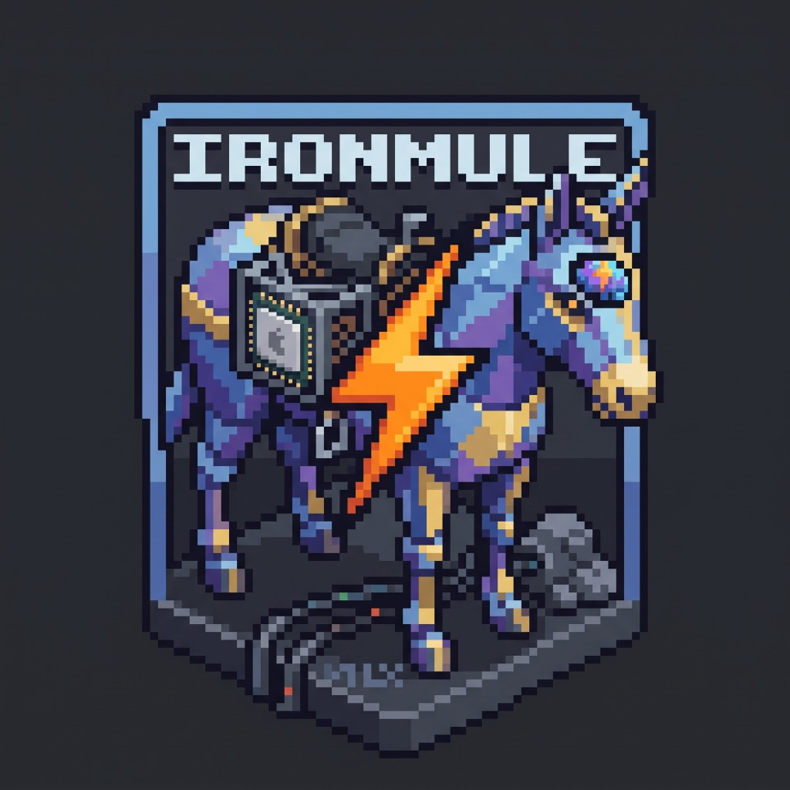
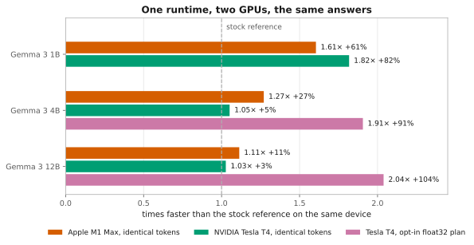
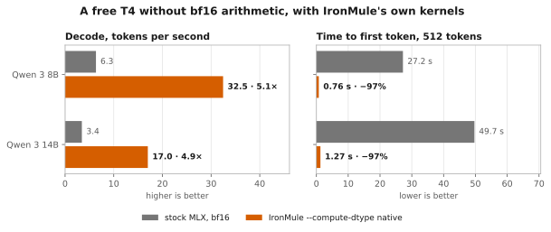
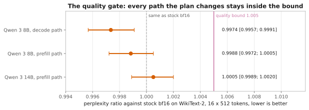
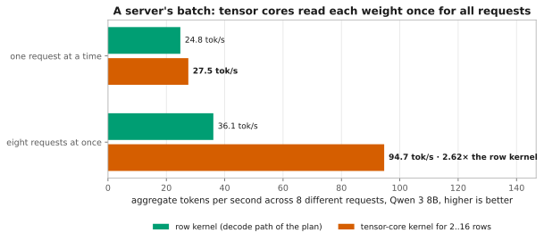
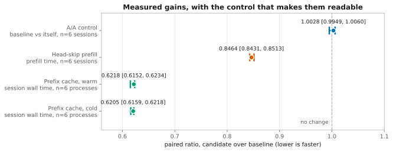
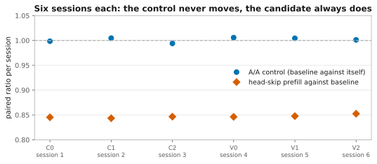
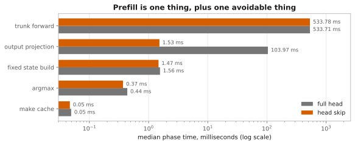
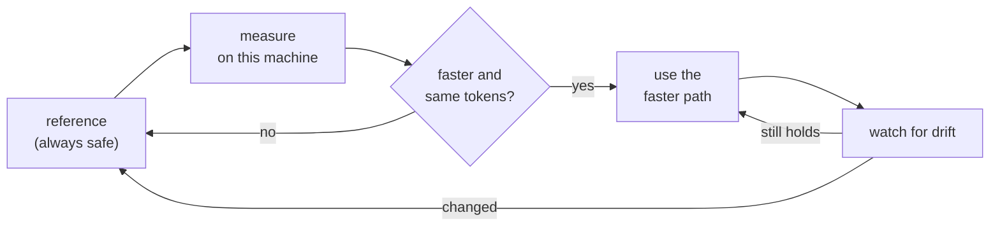

<div align="center">

  

  <h1>IronMule</h1>

  <p><strong>Local LLM inference on Apple Silicon and NVIDIA — up to 1.8× faster,<br>
  with byte-identical output.</strong></p>

  <p>
    <a href="https://github.com/Tobayko/IronMule/actions/workflows/ci.yml"></a>
    
    <a href="LICENSE.md"></a>
  </p>

  <p>
    
    
    
    
  </p>

  <p>
    <a href="#how-much-faster"><strong>Benchmarks</strong></a> ·
    <a href="#quick-start"><strong>Quick start</strong></a> ·
    <a href="#how-it-works"><strong>How it works</strong></a> ·
    <a href="docs/HTTP.md"><strong>HTTP API</strong></a> ·
    <a href="docs/LIMITS.md"><strong>Limits</strong></a>
  </p>

</div>

---

## What is IronMule?

**IronMule is an open-source local LLM inference runtime and OpenAI-compatible server for
Apple Silicon Macs (Metal) and Linux machines with an NVIDIA GPU (CUDA).** It runs on top
of [MLX](https://github.com/ml-explore/mlx) and serves models such as Gemma 3 fully
offline, on your own hardware.

It makes inference faster by choosing a better way to run the same model — reusing work,
skipping work that is not needed, and grouping requests — **without changing the output**.
Every speed-up has to prove on your machine that it returns the same tokens as the plain
reference path. If it cannot prove that, IronMule simply uses the reference.

- **Up to +82% faster** (1.82× on Gemma 3 1B, NVIDIA T4) and **+61%** on the same model on
  an M1 Max — every token identical to the reference. [All numbers](#how-much-faster).
- **Same answers, or no speed-up:** each optimisation is checked token by token before it
  is ever used.
- **Private by default:** fully offline. No prompts leave the machine, no model is
  downloaded unless you ask for it.
- **Drop-in:** an OpenAI-compatible HTTP server (`/v1/chat/completions`, streaming) and a
  three-line Python API.
- **Honest:** every number here comes from a committed measurement, including the ones
  that failed.

## How much faster?

<picture>
  <source media="(prefers-color-scheme: dark)" srcset="docs/assets/cross-platform-speedup-dark.svg">
  
</picture>

Same model, same prompts, greedy decoding, each device against its own stock MLX
reference — **higher is faster**.

| Model (4-bit) | Apple M1 Max | NVIDIA Tesla T4 | T4, opt-in `--compute-dtype float32` |
| :-- | --: | --: | --: |
| Gemma 3 1B | **1.61× · +61%** | **1.82× · +82%** | — |
| Gemma 3 4B | **1.27× · +27%** | 1.05× · +5% | **1.91× · +91%** |
| Gemma 3 12B | **1.11× · +11%** | 1.03× · +3% | **2.04× · +104%** |

Every run in the first two columns returned the same tokens as its reference — the
speed-up costs nothing in output. As wall-time ratios, which is how the raw data records
them: 0.623, 0.787 and 0.898 on the M1 Max, 0.550, 0.951 and 0.974 on the T4.

**The float32 column is a plan you switch on yourself.** Older NVIDIA GPUs (below compute
capability 8) have no native bf16, so MLX emulates it — badly enough that 4B and 12B barely
move otherwise. `--compute-dtype float32` computes the same weights in float32 instead:
about twice as fast on the T4, with a perplexity that matches float32 on Apple Silicon to
within 0.0001 nats per text chunk. Because it changes the output relative to bf16, IronMule
never turns it on by itself; `ironmule doctor` recommends it where it pays.

### Six more model families, same card

The table above is one family. These are the others, measured the same way on the same free
Kaggle T4 — stock MLX and IronMule in fresh, interleaved processes, six requests of 48
greedy tokens, median of two repetitions. Every model is a 4-bit `mlx-community` checkpoint
at a pinned revision. Raw data: `experiments/kaggle_compat/results/port2-run*/`.

| Model (4-bit) | Weights | Exact, same tokens | `--compute-dtype float32` | `--compute-dtype float16` |
| :-- | --: | --: | --: | --: |
| Gemma 4 E2B | 3.55 GB | **1.11× · +11%** | 2.43× · +143%, gate unusable | 3.94× · +294%, gate unusable |
| Gemma 4 E4B | 5.15 GB | **1.08× · +8%** | 2.23× · +123%, gate unusable | 3.69× · +269%, gate unusable |
| Gemma 4 E4B qat | 6.80 GB | **1.09× · +9%** | 1.73× · +73%, gate unusable | 3.18× · +218%, gate unusable |
| Gemma 3 4B | 2.50 GB | **1.07× · +7%** | **1.91× · +91%** | 3.21× · +221%, **fails its quality gate** |
| Llama 3.1 8B | 4.52 GB | **1.03× · +3%** | **0.66× · −34%** | not measured |
| Qwen 3 8B | 4.61 GB | **1.04× · +4%** | **1.87× · +87%** | **3.23× · +223%** |
| Qwen 3 14B | 8.31 GB | **1.03× · +3%** | **1.94× · +94%** | gate passed, speed not measured |
| gpt-oss 20B | 11.18 GB | **1.03× · +3%** | **3.55× · +255%** | 5.02× · +402%, gate not yet qualified |
| Mistral Small 3.2 24B | 13.26 GB | **1.01× · +1%** | **1.82× · +82%** | not measured |

Gemma 4 gives the largest exact gain of any family here, and it gets it with projection
fusion switched off — its block body is not one IronMule has transcribed, so fusion refuses
it. Its numeric plans say `gate unusable` rather than a number because the gate ran and the
result cannot be used: the bfloat16 reference it measures against scores a perplexity of
22 212 on the text where Gemma 3 4B scores 100.5, through the same harness. Chat decoding is
fine and token-identical to stock, so the speed is real and the quality is unestablished.

Every exact arm returned the same tokens as its stock reference on all six requests. The
exact gain past Gemma 3 is small — one to seven per cent, not the 82 per cent Gemma 3 1B
reaches — and the numeric plan is where an older NVIDIA card is won.

**A numeric plan is per model, and the quality gate is what says so.** WikiText-2 raw test,
16 chunks of 512 tokens, perplexity ratio against the checkpoint's own bfloat16 with a
10 000-sample bootstrap; a plan passes when the upper bound stays under 1.005.

| Plan | Model | Perplexity ratio | Verdict |
| :-- | :-- | :-- | :-- |
| `float32` | Llama 3.1 8B | 1.000126 `[0.999993; 1.000260]` | passes |
| `float32` | Qwen 3 8B | 0.997817 `[0.996177; 0.999584]` | passes |
| `float16` | Qwen 3 8B | 0.997689 `[0.996051; 0.999454]` | passes |
| `float16` | Qwen 3 14B | 1.001222 `[0.999873; 1.002603]` | passes |
| `float32` | Mistral Small 3.2 24B | 0.998019 `[0.996057; 0.999910]` | passes |
| `float16` | Gemma 3 4B | 2.043792 `[1.873506; 2.244196]` | **fails** — perplexity 102.5 → 209.6 |
| `native`, decode path | Qwen 3 8B | 0.997356 `[0.995672; 0.999090]` | passes |
| `native`, prefill path | Qwen 3 8B | 0.998839 `[0.997220; 1.000515]` | passes |
| `native`, prefill path | Qwen 3 14B | 1.000510 `[0.998894; 1.002001]` | passes |

Same card, same code, opposite verdicts: float16's exponent range carries Qwen 3 and not
Gemma 3. So neither plan is ever enabled for you, and neither is recommended for a model
that has not passed this gate on your own hardware.

### IronMule's own kernels: five times faster on a free T4

<picture>
  <source media="(prefers-color-scheme: dark)" srcset="docs/assets/t4-native-kernels-dark.svg">
  
</picture>

A T4 has no bfloat16 arithmetic, and MLX's CUDA matmuls accumulate in the activation type, so
a bf16 checkpoint spends every decode step in emulation — Qwen 3 8B ran at 6.3 tokens per second
on a card whose memory bandwidth allows about 70. `--compute-dtype native` keeps the checkpoint
and does its 4-bit matmuls on IronMule's own CUDA kernels instead: decode reads bfloat16 as raw
bits and accumulates in float32, prefill dequantises to float16 and runs one tensor-core GEMM.

| Model (4-bit) | `ironmule benchmark` workload | Decode | Time to first token, 512 tokens |
| :-- | --: | --: | --: |
| Qwen 3 8B | **4.97× · +397%** | 6.3 → 32.5 tok/s | 27.2 s → 0.76 s |
| Qwen 3 14B | **4.81× · +381%** | 3.4 → 17.0 tok/s | 49.7 s → 1.27 s |

The first column is IronMule's own product path against stock, fresh interleaved processes as
in the tables above; on Qwen 3 8B all six requests returned the same tokens as stock. It is for
NVIDIA GPUs below compute capability 8 (Turing, Volta), refused anywhere else, checked against a
float32 reference on the model's own weights before it is installed, and `ironmule plans`
recommends it for Qwen 3 there. Like every numeric plan it changes the arithmetic, so it has to
pass the quality gate on every path it touches:

<picture>
  <source media="(prefers-color-scheme: dark)" srcset="docs/assets/t4-native-quality-dark.svg">
  
</picture>

**Serving several requests at once.** The decode kernel reads the weights once per request. A
second kernel, built on the T4's tensor cores, multiplies each weight with up to 16 requests in
one pass, which is what a server with several open conversations needs:

<picture>
  <source media="(prefers-color-scheme: dark)" srcset="docs/assets/t4-server-batching-dark.svg">
  
</picture>

Eight different requests at once reach 94.7 tokens per second on Qwen 3 8B, 2.62 times the row
kernel in the same run, and the median wait for a first token drops from 26 s to 0.54 s because
nobody queues. On Mistral Small 3.2 24B, the largest dense model that fits one card, the same
comparison gives 15.168 against 8.802 tokens per second, and its single stream decodes at 11.431
tokens per second instead of 2.140, tokens identical. With the prefill kept to one float16
copy at a time, its first token arrives after 1.68 s instead of 77.6 s, and eight requests
reach 31.05 tokens per second. This one is measured, not shipped: batched answers in bf16 are not always the
same as answers served alone, and IronMule's server promises exactly that, so it waits for its
own opt-in mode (`docs/PROJECT_FRIDAY_BACKLOG.md`, PERF1-K). Everything here: `research/LEDGER.md`,
PERF1, and `experiments/kaggle_compat/results/perf1-run*/`.

**The ceiling on one card.** A single MLX process uses a single device, so 15360 MiB is the
budget. The largest checkpoint measured to run is Gemma 4 26B-A4B: 15.34 GB on disk,
14.20 GB resident, peak 14.30 GB, decoding correctly. Mistral Small 3.2 24B runs at 13.26 GB
and its `float32` arm peaks at 15.24 GB and still fits. 16.05 GB does not load. Tensor parallelism across both T4s of a
Kaggle cell works with MLX's ring backend and halves per-rank weights with identical tokens,
but that is stock mlx-lm — IronMule is single-process and cannot join a distributed group —
and it is slow: the ring backend reduces over TCP twice per layer per token, and Qwen 3 8B
decoded at a third of one card's speed (PERF1).

**Two cards, split by layers.** The PERF1 harness can instead give each T4 half of the layers
and hand over once per token. That runs Qwen 3 32B (18.43 GB) on the free cell, 9551 MiB per
card, decoding at 1.566 tokens per second stock and 8.54 with the native kernels, tokens
identical; with the tensor-core kernel eight requests at once reach 20.403 tokens per second,
2.46 times the row kernel in the same run. The hand-over costs Qwen 3 8B half its decode rate,
and this is harness code around stock mlx-lm, not an IronMule mode (`research/LEDGER.md`,
PERF1, "two cards lift the ceiling to 32B").

**None of this transfers to a TPU.** MLX has two device types, `cpu` and `gpu`; there is no
TPU backend, so IronMule does not run there. It is also the wrong lesson to carry: on a
Kaggle TPU v5e a decode step's matmuls cost 0.478 ms in bfloat16 and 0.942 ms in float32, so
bfloat16 is native and twice as fast. The whole `--compute-dtype` idea exists only because
Turing emulates bfloat16 and is slower at it than at float32.

### Where the speed comes from

<picture>
  <source media="(prefers-color-scheme: dark)" srcset="docs/assets/headline-ratios-dark.svg">
  
</picture>

Individual optimisations on the M1 Max with Gemma 3 4B, each against an A/A control that
measures the machine's own noise (1.0028, so anything inside ±0.6% is not a result):

| Optimisation | Measured ratio | In plain terms |
| :-- | --: | :-- |
| Head-skip prefill | 0.846 | prompt processing **+18% faster** |
| Prefix cache, warm | 0.622 | repeated questions on one document **+61% faster** |
| Prefix cache, cold | 0.621 | **+61%**, even on the first session |

<details>
<summary>Two more figures: every session, and where prefill time actually goes</summary>

<picture>
  <source media="(prefers-color-scheme: dark)" srcset="docs/assets/session-ratios-dark.svg">
  
</picture>

<picture>
  <source media="(prefers-color-scheme: dark)" srcset="docs/assets/prefill-phases-dark.svg">
  
</picture>

</details>

Every figure on this page is rendered from committed measurement data by
`tools/make_figures.py`, and CI fails if a figure stops matching the data behind it.

> [!IMPORTANT]
> These numbers were measured on one Apple M1 Max (32 GB) and one Kaggle Tesla T4. They
> are not a promise for every machine or model. Run `ironmule benchmark` on yours. Details:
> [research/LEDGER.md](research/LEDGER.md) (entries `PORT1`, `B39d`, `E16`) and
> [docs/LIMITS.md](docs/LIMITS.md).

## Quick start

### 1. Install

You need Python 3.10 or newer. The package is installed from this repository.

```bash
git clone https://github.com/Tobayko/IronMule.git
cd IronMule
python -m venv .venv && source .venv/bin/activate

pip install -e .            # Apple Silicon Mac
pip install -e ".[cuda]"    # Linux with an NVIDIA GPU
```

### 2. Check your machine

```bash
ironmule doctor
```

```text
IronMule doctor
[OK] Apple Silicon architecture: arm64 (Apple M1 Max)
[OK] macOS: Darwin
[OK] Python: 3.12.13 (requires >= 3.10)
[OK] MLX: 0.32.0; importable (isolated probe)
[OK] MLX-LM: 0.31.3; importable (isolated probe)
[OK] NumPy: 2.5.2; importable (isolated probe)
[OK] MLX Metal device: Metal GPU operation verified

All runtime prerequisites are available.
```

On Linux the same command checks for an MLX CUDA device instead.

### 3. Get a model and start the server

```bash
ironmule setup --mode desktop
ironmule models list
ironmule models add mlx-community/gemma-3-1b-it-4bit --download
ironmule serve --model mlx-community/gemma-3-1b-it-4bit
```

The server listens on `http://127.0.0.1:8080` and speaks the OpenAI chat API:

```bash
curl http://127.0.0.1:8080/v1/chat/completions \
  -H "Content-Type: application/json" \
  -d '{"model": "mlx-community/gemma-3-1b-it-4bit",
       "messages": [{"role": "user", "content": "Hello!"}]}'
```

Add `"stream": true` for streamed tokens. Routes, authentication and TLS are described in
[docs/HTTP.md](docs/HTTP.md) and [docs/PRODUCT_QUICKSTART.md](docs/PRODUCT_QUICKSTART.md).

### 4. Or use it from Python

```python
import ironmule

runtime = ironmule.Runtime.load(model_id="mlx-community/gemma-3-4b-it-4bit")
result = runtime.generate("Explain unified memory in two short sentences.", max_tokens=96)

print(result.text)
```

`Runtime.load` uses a model that is already in your Hugging Face cache
(`hf download mlx-community/gemma-3-4b-it-4bit`). More in [docs/RUNTIME.md](docs/RUNTIME.md).

## Choosing a mode

| Your situation | Use | What you get |
| :-- | :-- | :-- |
| One chat, fastest reply | `InteractiveMode` (default) | Lowest latency per request |
| Several requests at once | `ThroughputMode` | More tokens per second in total |
| Many questions about one document | `ReusableSessionPlan` | The shared prompt is computed once |
| Older NVIDIA GPU (Turing, Volta) | `--compute-dtype float32` | About 2× faster on 4B and 12B, [see above](#how-much-faster) |

`ironmule tune` measures the available optimisations on your machine and keeps only the
ones that are faster **and** produce identical tokens.

## How it works

A fresh install knows nothing about your hardware and serves the reference path. From
there IronMule learns what your machine has actually earned:



The main techniques:

- **Grouped execution** — several requests share the time the GPU would otherwise wait.
- **Head skip** — the prompt is processed without computing output logits it never uses.
- **Prefix reuse** — a shared document prefix is computed once and reused bit-exactly.
- **Fixed compiled cache** — fewer, larger GPU kernels per token.
- **Hardware awareness** — per-device settings, for example larger CUDA graphs on older
  NVIDIA GPUs.

Anything that could change the output (a different numeric precision, sampling, true
tensor batching) is never chosen automatically.

## Commands

| Command | What it does |
| :-- | :-- |
| `ironmule doctor` | Check Python, MLX and the GPU (Metal or CUDA) |
| `ironmule setup` | Create local settings |
| `ironmule models` | List and register cached models |
| `ironmule serve` | Start the OpenAI-compatible server |
| `ironmule benchmark` | Compare interactive and throughput mode on your machine |
| `ironmule tune` | Find the fastest token-identical settings for a model |
| `ironmule revalidate` | Check that a stored tuning result still holds |
| `ironmule optimize` | Run a bounded, paced calibration and show its history |
| `ironmule status` | Show hardware and tuning status |
| `ironmule info` | Show package information |

Run `ironmule <command> --help` for all options.

## Limits

- Decoding is greedy; `temperature` and `top_p` are accepted and ignored.
- Concurrent requests to the server queue in arrival order.
- Model weights are never bundled or redistributed.
- Measured on Gemma 3 (4-bit); other models work through MLX-LM but carry no speed claim.
- Some research features are Apple-only (Metal kernels, macOS process guards) and are
  refused or skipped on CUDA.

The full validity domain is in [docs/LIMITS.md](docs/LIMITS.md). Ideas that were measured
and rejected stay documented in [docs/BACKLOG.md](docs/BACKLOG.md).

## Contributing

Contributions are welcome — see [CONTRIBUTING.md](CONTRIBUTING.md). A performance claim
needs a measurement; community benchmark results use the fields in
[docs/COMMUNITY_BENCHMARKS.md](docs/COMMUNITY_BENCHMARKS.md). Also:
[code of conduct](CODE_OF_CONDUCT.md) and [security policy](SECURITY.md) — report a
vulnerability privately, never in an issue.

```bash
pip install -e ".[dev]"
pytest tests/engine -m "not integration"
```

This repository also contains **Project Friday**, the research behind the numbers: every
study with its preregistration, raw data and the experiments that failed. Start at
[docs/README_PROJECT_FRIDAY.md](docs/README_PROJECT_FRIDAY.md).

## License

IronMule is open source under the [Apache License 2.0](LICENSE.md). You can use, modify and
distribute it, including in commercial products.

<div align="center">
  <br>
  <strong>Faster local inference, or your tokens back.</strong><br>
  <sub>If IronMule saved you time on your own machine, a star helps the next person find
  it — and a <a href="docs/COMMUNITY_BENCHMARKS.md">benchmark from your hardware</a> helps
  even more.</sub>
</div>
