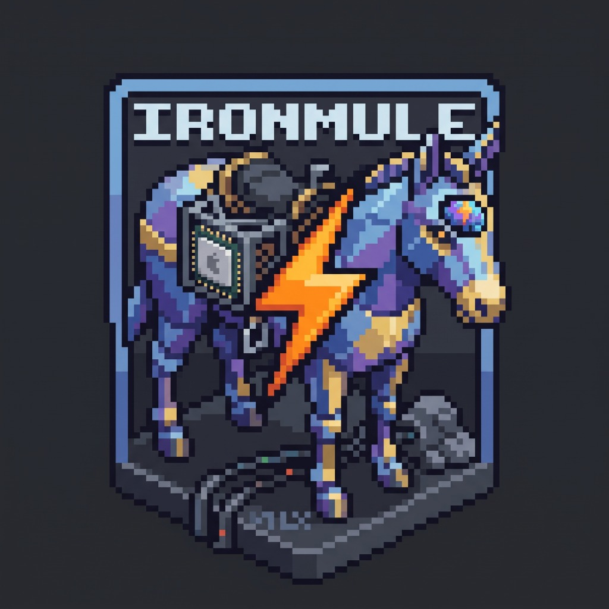
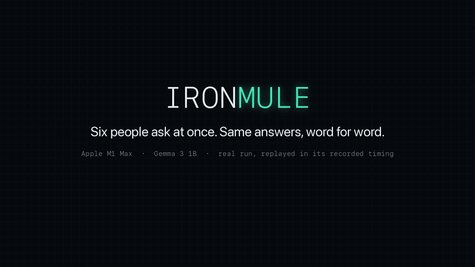

<div align="center">

  

  <h1>IronMule</h1>

  <p><strong>Local LLM inference on Apple Silicon and NVIDIA — up to 1.82× faster with<br>
  byte-identical output, or up to 5× with an opt-in numeric plan on older NVIDIA GPUs.</strong></p>

  <p>
    <a href="https://github.com/Tobayko/IronMule/actions/workflows/ci.yml"></a>
    
    <a href="LICENSE.md"></a>
    
    
    
    
  </p>

  <p>
    <a href="https://ironmule.prometo.app/"><strong>Website</strong></a> ·
    <a href="docs/BENCHMARKS.md"><strong>Benchmarks</strong></a> ·
    <a href="#quick-start"><strong>Quick start</strong></a> ·
    <a href="#how-it-works"><strong>How it works</strong></a> ·
    <a href="docs/HTTP.md"><strong>HTTP API</strong></a> ·
    <a href="docs/LIMITS.md"><strong>Limits</strong></a>
  </p>

</div>

---

## What is IronMule?

**IronMule is an open-source local LLM inference runtime and OpenAI-compatible server for Apple Silicon Macs (Metal) and Linux machines with an NVIDIA GPU (CUDA), and — more slowly — Linux machines with only a CPU.** It runs on [MLX](https://github.com/ml-explore/mlx), serving models such as Gemma 3 fully offline, on your own hardware, by reusing work, skipping work that is not needed, and grouping requests — without changing the output by default. It ships as a one-line installer, an OpenAI-compatible HTTP server, and a three-line Python API.

<a href="docs/assets/ironmule-live-race.mp4"></a>

Gemma 3 1B on an Apple M1 Max, six questions at once: reference path on the left, IronMule's tuned, grouped settings on the right. Every token is identical on both sides. [Full-resolution video (MP4)](docs/assets/ironmule-live-race.mp4).

## How much faster?

- **Exact mode — same tokens as stock:** up to 1.82× (+82%) on Gemma 3 1B on an NVIDIA Tesla T4, 1.61× (+61%) on the same model on an Apple M1 Max. Checked token by token before use; falls back to the reference if it cannot prove identical output.
- **Opt-in numeric plans — different arithmetic, quality-gated:** on NVIDIA GPUs below compute capability 8 (Turing, Volta — e.g. Tesla T4), `--compute-dtype native` reaches up to 5.00× (+400%) on Gemma 3 12B. It changes the arithmetic relative to bf16, must pass a perplexity gate, and `ironmule plans` recommends it only for the checkpoints it has measured (Qwen 3 8B, Qwen 3 14B, Gemma 3 12B).

| Model (4-bit) | Apple M1 Max | NVIDIA Tesla T4 | T4, opt-in `--compute-dtype float32` |
| :-- | --: | --: | --: |
| Gemma 3 1B | **1.61× · +61%** | **1.82× · +82%** | — |
| Gemma 3 4B | **1.27× · +27%** | 1.05× · +5% | **1.91× · +91%** |
| Gemma 3 12B | **1.11× · +11%** | 1.03× · +3% | **2.04× · +104%** |

Measured on one Apple M1 Max and one Kaggle Tesla T4 — run `ironmule benchmark` on yours. Six more model families, native-kernel and quality-gate detail, and server batching: **[docs/BENCHMARKS.md](docs/BENCHMARKS.md)**.

## Quick start

Two commands, on an Apple Silicon Mac or a Linux machine (with an NVIDIA GPU, or with only a CPU):

```bash
curl -fsSL https://raw.githubusercontent.com/Tobayko/IronMule/main/install.sh | sh
ironmule start
```

Installs IronMule as its own command; `start` asks before downloading a model (Gemma 3 4B) and opens a chat at `http://127.0.0.1:8080`. No GPU? Then the installer takes the CPU build and `start` picks the small Qwen3 0.6B and asks whether it may unpack the weights to float32, which made answers about 7.6× faster on a 4-core Kaggle CPU (one run). It works, but expect about a minute for a short answer. Another model: `ironmule start --model mlx-community/Qwen3-4B-Instruct-2507-4bit`. From source, step by step (Python 3.10+):

```bash
git clone https://github.com/Tobayko/IronMule.git
cd IronMule
python -m venv .venv && source .venv/bin/activate

pip install -e .            # Apple Silicon Mac
pip install -e ".[cuda]"    # Linux with an NVIDIA GPU
pip install -e ".[cpu]"     # Linux without a GPU (slow)
```

Check the machine, then get a model and serve it:

```bash
ironmule doctor
ironmule setup --mode desktop
ironmule models list
ironmule models add mlx-community/gemma-3-1b-it-4bit --download
ironmule serve --model mlx-community/gemma-3-1b-it-4bit
```

`ironmule doctor --json` gives a machine-readable report. The server listens on `http://127.0.0.1:8080`: open it in a browser, or call the OpenAI-compatible API:

```bash
curl http://127.0.0.1:8080/v1/chat/completions \
  -H "Content-Type: application/json" \
  -d '{"model": "mlx-community/gemma-3-1b-it-4bit",
       "messages": [{"role": "user", "content": "Hello!"}]}'
```

Add `"stream": true` for streamed tokens; routes, auth and TLS are in [docs/HTTP.md](docs/HTTP.md). Or use it from Python:

```python
import ironmule

runtime = ironmule.Runtime.load(model_id="mlx-community/gemma-3-4b-it-4bit")
result = runtime.generate("Explain unified memory in two short sentences.", max_tokens=96)

print(result.text)
```

`Runtime.load` uses a model already in your Hugging Face cache (`hf download mlx-community/gemma-3-4b-it-4bit`). More: [docs/RUNTIME.md](docs/RUNTIME.md).

## It learns from your machine

`ironmule autopilot` and `ironmule learn` turn IronMule into a small learning system. It does not use a language model to make decisions; it uses statistics that update after every test it runs.

1. **It tests.** It tries engine settings on your hardware and measures each one against the plain reference. A setting only counts if it gives exactly the same tokens.
2. **It remembers.** Every test is stored: what was changed, how much faster or slower it was, and how long the test took. The memory survives restarts.
3. **It decides what to test next.** A small Bayesian model written in Rust (`native/experiment_planner`) estimates, for every possible change, how much it will probably help and how long it takes to try. It runs the test with the best expected gain per second, and stops when nothing is worth the time. Every new result updates the estimates a little; nothing is retrained from scratch.
4. **It dreams.** Between sessions it replays its old tests — like the *Dream-RSI* paper ([arXiv 2609.14858](https://arxiv.org/html/2609.14858v1)) — to tune how it plans. Replay never replaces a real test, and if replay shows that the simple fixed order would have done better, it switches itself off and uses that order instead.
5. **It double-checks.** The best setting still has to win a paired A/B test against the reference before it is used. While serving, an online controller keeps comparing and falls back to the reference whenever something looks off.

What this gave on a Kaggle Tesla T4, on five models it had never seen: 3–6 tests instead of 11, about 24 % less tuning time, and on average as much confirmed speed-up as the fixed order (20.2 vs 19.8 percentage points; more on four models, less on Gemma 3 1B). One machine, one run per method — treat it as a first result, not a promise.

```bash
ironmule learn --minutes 12                       # a bounded hardware session over your cached models
ironmule autopilot --model mlx-community/gemma-3-1b-it-4bit
```

The learning parts are built from source and need Rust (`cargo`):

```bash
cargo build --release --manifest-path native/online_controller/Cargo.toml
cargo build --release --manifest-path native/experiment_planner/Cargo.toml
```

Without the planner, tuning uses the fixed order; without the controller, `autopilot` stops with a message that says how to build it. Details and limits: [docs/LIMITS.md](docs/LIMITS.md).

## Choosing a mode

| Your situation | Use | What you get |
| :-- | :-- | :-- |
| One chat, fastest reply | `InteractiveMode` (default) | Lowest latency per request |
| Several requests at once | `ThroughputMode` | More tokens per second in total |
| Many questions about one document | `ReusableSessionPlan` | The shared prompt is computed once |
| Older NVIDIA GPU (Turing, Volta) | `--compute-dtype float32` | About 2× faster on 4B and 12B |

`ironmule tune` measures your machine and keeps only optimisations that are faster **and** identical.

## How it works

A fresh install serves the reference path; IronMule promotes a faster path only after measuring that it is both faster and identical on your machine, and keeps watching for drift back to the reference. Anything that could change the output (precision, sampling, true tensor batching) is opt-in, never chosen automatically.

- **Grouped execution** — several requests share the time the GPU would otherwise wait.
- **Head skip** — the prompt is processed without computing output logits it never uses.
- **Prefix reuse** — a shared document prefix is computed once and reused bit-exactly.
- **Fixed compiled cache** — fewer, larger GPU kernels per token.
- **Hardware awareness** — per-device settings that cannot change the output.

## Can I trust the numbers?

Every speed-up above comes from a measurement that is published, not just quoted.

- **Same tokens, or it says so.** Exact mode is checked token by token against the reference. A numeric plan changes the arithmetic, so it must also keep perplexity within 0.5 % of the reference on every path it touches, and `ironmule plans` recommends it only for checkpoints that passed.
- **Rejected ideas stay visible.** Failed and inconclusive results are recorded in the [research lab](https://github.com/Tobayko/IronMule-Research), so you can see what did not work and why.
- **Check it yourself.** The numbers live in [`evidence/`](evidence/) (redacted: no prompts or generated text). Each figure is redrawn from them, and tests pin the numbers in this README to them:

```bash
pip install -e ".[dev,figures]"
python tools/make_figures.py --check        # every figure matches its evidence
python -m pytest tests/claims               # every published number matches its evidence
ironmule benchmark                          # measure your own machine
```

## What is in this repository

| Folder | What it is |
| :-- | :-- |
| `ironmule/` | The runtime: model loading, generation, cache, plans, kernels |
| `ironmule_product/` | The server, chat page, calibration and worker processes |
| `native/` | Rust: the online controller and the experiment planner (learning core) |
| `friday_evidence/` | Storage and provenance for measurements |
| `evidence/` | Redacted results behind every published number |
| `tests/` | `engine/` and `runtime/` (runtime, server), `learning/` (learned dispatch), `evidence/` and `claims/` (measurements, published numbers) |
| `docs/` | User documentation, index in [docs/README.md](docs/README.md) |
| `tools/` | Figure and evidence tools |

Raw data, experiment scripts and the full research record live in the separate [IronMule-Research](https://github.com/Tobayko/IronMule-Research) repository. Website: [ironmule.prometo.app](https://ironmule.prometo.app/).

## Learn more

- **[Benchmarks](docs/BENCHMARKS.md)** — every model family, native kernels, quality gates.
- **[HTTP API](docs/HTTP.md)** · **[Runtime](docs/RUNTIME.md)** · **[Limits](docs/LIMITS.md)** (rejected ideas: [docs/BACKLOG.md](docs/BACKLOG.md))
- **[Documentation index](docs/README.md)** — every other doc, including the pinned qualification specs.
- **[Evidence](evidence/)** — the redacted measurement behind every number here.
- **[Research lab](https://github.com/Tobayko/IronMule-Research)** — preregistrations, the ledger, and every experiment, including the ones that failed.
- **[Contributing](CONTRIBUTING.md)** · [code of conduct](CODE_OF_CONDUCT.md) · [security policy](SECURITY.md)
- **[License](LICENSE.md)** — Apache 2.0.
