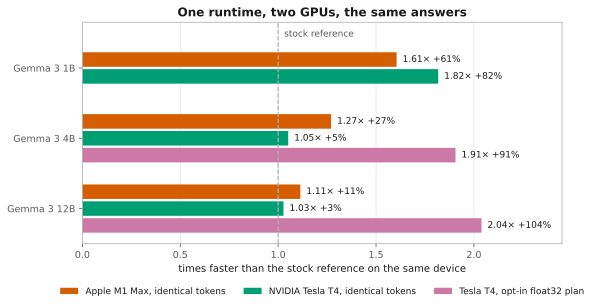
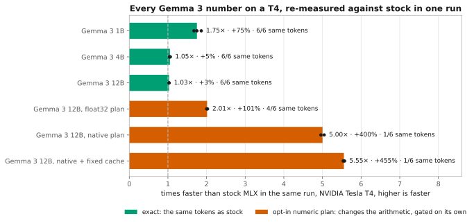
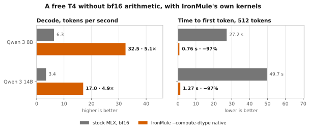
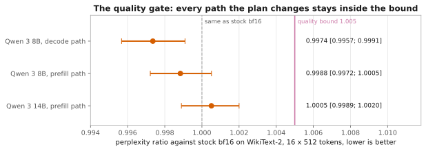
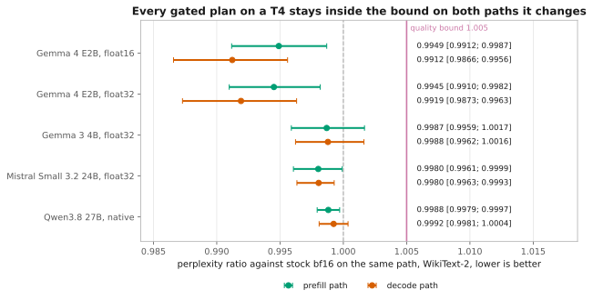
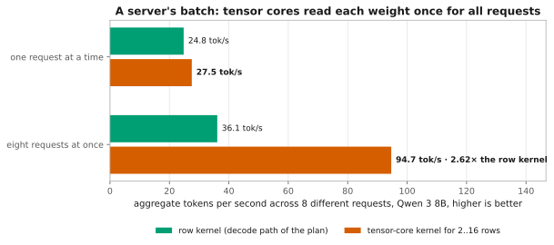
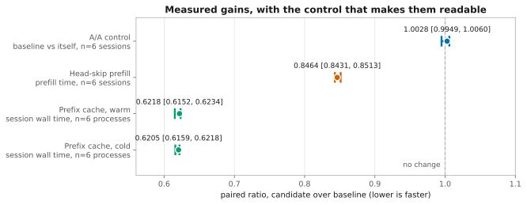
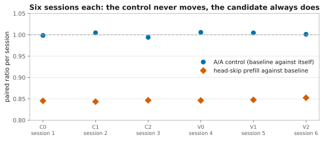
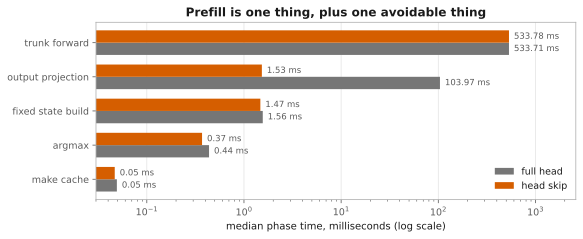

# Benchmarks

The full numbers behind IronMule's speed claims. The short version lives in
[README.md](../README.md); this page keeps every model family, the native-kernel and
quality-gate detail, and server batching, unshortened.

## How much faster?

<picture>
  <source media="(prefers-color-scheme: dark)" srcset="assets/cross-platform-speedup-dark.svg">
  
</picture>

Same model, same prompts, greedy decoding, each device against its own stock MLX
reference — **higher is faster**. The Gemma 3 1B/4B/12B summary table (Apple M1 Max,
NVIDIA Tesla T4, and the T4's opt-in `--compute-dtype float32` column) is in
[README.md](../README.md#how-much-faster).

Every run in the first two columns of that table returned the same tokens as its
reference — the speed-up costs nothing in output. As wall-time ratios, which is how the
raw data records them: 0.623, 0.787 and 0.898 on the M1 Max, 0.550, 0.951 and 0.974 on
the T4.

**The float32 column is a plan you switch on yourself.** Older NVIDIA GPUs (below compute
capability 8) have no native bf16, so MLX emulates it — badly enough that 4B and 12B barely
move otherwise. `--compute-dtype float32` computes the same weights in float32 instead:
about twice as fast on the T4, with a perplexity that matches float32 on Apple Silicon to
within 0.0001 nats per text chunk. Because it changes the output relative to bf16, IronMule
never turns it on by itself; `ironmule doctor` recommends it where it pays.

### Re-measured: every Gemma 3 number in one run

<picture>
  <source media="(prefers-color-scheme: dark)" srcset="assets/t4-run18-rerun-dark.svg">
  
</picture>

On 2026-09-25 one Kaggle T4 session (PERF1 run 18) measured every Gemma 3 arm again, each
against a stock arm in the same repetition, so no number is chained across runs. Every
published ratio came back within 5% — 1B at **1.75× · +75%**, 12B float32 at
**2.01× · +101%** — and every exact arm returned stock's tokens in 6 of 6 requests. The same
run measures the `native` plan with `compiled_fixed_cache` directly against stock on
Gemma 3 12B: **5.55× · +455%**, where 5.52× had been projected from two runs. These are
speed numbers; each plan's quality gate is further down. Evidence:
`evidence/kaggle/perf1-run18-863237d6/`.

### Six more model families, same card

Gemma 3 is one family. These are the others, measured the same way on the same free
Kaggle T4 — stock MLX and IronMule in fresh, interleaved processes, six requests of 48
greedy tokens, median of two repetitions. Every model is a 4-bit `mlx-community` checkpoint
at a pinned revision. Evidence: `evidence/kaggle/port2-run*/`.

| Model (4-bit) | Weights | Exact, same tokens | `--compute-dtype float32` | `--compute-dtype float16` |
| :-- | --: | --: | --: | --: |
| Gemma 4 E2B | 3.55 GB | **1.11× · +11%** | **2.43× · +143%** | **3.94× · +294%** |
| Gemma 4 E4B | 5.15 GB | **1.08× · +8%** | 2.23× · +123%, no gate | 3.69× · +269%, no gate |
| Gemma 4 E4B qat | 6.80 GB | **1.09× · +9%** | 1.73× · +73%, no gate | 3.18× · +218%, no gate |
| Gemma 3 4B | 2.50 GB | **1.07× · +7%** | **1.91× · +91%** | 3.21× · +221%, **fails its quality gate** |
| Llama 3.1 8B | 4.52 GB | **1.03× · +3%** | **0.66× · −34%** | not measured |
| Qwen 3 8B | 4.61 GB | **1.04× · +4%** | **1.87× · +87%** | **3.23× · +223%** |
| Qwen 3 14B | 8.31 GB | **1.03× · +3%** | **1.94× · +94%** | gate passed, speed not measured |
| gpt-oss 20B | 11.18 GB | **1.03× · +3%** | 3.55× · +255%, gate not qualifiable here | 5.02× · +402%, gate not qualifiable here |
| Mistral Small 3.2 24B | 13.26 GB | **1.01× · +1%** | **1.82× · +82%** | not measured |

Gemma 4 gives the largest exact gain of any family here, and it gets it with projection
fusion switched off — its block body is not one IronMule has transcribed, so fusion refuses
it. Its first quality gate could not be used: Gemma's tokenizer adds no BOS, so the gate's
chunks had none, and the bfloat16 reference scored a perplexity of 22 212. Run again with BOS
on every chunk (PORT2-K, 2026-09-26) the reference scores 355.7 — still far above Gemma 3 4B's
27.0, and not the 4-bit quantisation: the 8-bit and bfloat16 checkpoints score 295.9 and 307.6 —
and both plans sit inside the bound on E2B, a little better than
bfloat16 itself. Chat decoding returned stock's tokens in 5 of 6 requests for either plan, so
`ironmule plans` now recommends `float16` for Gemma 4 E2B on these cards. The E4B
checkpoints share the architecture but no gate ran on them, so they get no
recommendation of their own (a recommendation covers only the checkpoints it measured, at the
revision and with the MLX and mlx-lm versions measured).

gpt-oss 20B's plans cannot be qualified on this card at all. Its router picks four of 32
experts per token, and the emulated bfloat16 reference cannot order router scores that close:
about a fifth of its expert choices differ from any higher-precision computation of the same
checkpoint, while `float32` and `float16` agree with each other on 97–99% of them. A gate
against that reference measures its rounding, not the plan. IronMule keeps its rule — a plan is
qualified against the checkpoint's own bfloat16 or not at all — so both plans stay opt-in and
unrecommended for gpt-oss until a GPU with native bfloat16 provides the reference.

Every exact arm returned the same tokens as its stock reference on all six requests. The
exact gain past Gemma 3 is small — one to seven per cent, not the 82 per cent Gemma 3 1B
reaches — and the numeric plan is where an older NVIDIA card is won.

**A numeric plan is per model, and the quality gate is what says so.** WikiText-2 raw test,
16 chunks of 512 tokens, perplexity ratio against the checkpoint's own bfloat16 with a
10 000-sample bootstrap; a plan passes when the upper bound stays under 1.005.

| Plan | Model | Perplexity ratio | Verdict |
| :-- | :-- | :-- | :-- |
| `float32` | Llama 3.1 8B | 1.000126 `[0.999993; 1.000260]` | passes |
| `float32` | Qwen 3 8B | 0.997817 `[0.996177; 0.999584]` | passes |
| `float16` | Qwen 3 8B | 0.997689 `[0.996051; 0.999454]` | passes |
| `float16` | Qwen 3 14B | 1.001222 `[0.999873; 1.002603]` | passes |
| `float32` | Mistral Small 3.2 24B | 0.998019 `[0.996057; 0.999910]` | passes |
| `float32` | Gemma 3 4B, BOS on every chunk | 0.998686 `[0.995891; 1.001671]` | passes |
| `float32` | Gemma 4 E2B, BOS on every chunk | 0.994514 `[0.990986; 0.998173]` | passes |
| `float16` | Gemma 4 E2B, BOS on every chunk | 0.994901 `[0.991176; 0.998687]` | passes |
| `float16` | Gemma 3 4B, BOS on every chunk | 2.044178 `[1.960923; 2.138012]` | **fails** — perplexity 27.0 → 55.2 (without BOS 102.5 → 209.6) |
| `native`, decode path | Qwen 3 8B | 0.997356 `[0.995672; 0.999090]` | passes |
| `native`, prefill path | Qwen 3 8B | 0.998839 `[0.997220; 1.000515]` | passes |
| `native`, prefill path | Qwen 3 14B | 1.000510 `[0.998894; 1.002001]` | passes |
| `native`, decode path | Qwen 3 14B | 1.000526 `[0.999000; 1.002018]` | passes |
| `native`, decode path | Gemma 3 12B | 1.000578 `[0.997951; 1.003197]` | passes |
| `native`, prefill path | Gemma 3 12B | 1.000643 `[0.998250; 1.003185]` | passes |

Same card, same code, opposite verdicts: float16's exponent range carries Qwen 3 and not
Gemma 3. So neither plan is ever enabled for you, and neither is recommended for a model
that has not passed this gate on your own hardware.

### IronMule's own kernels: five times faster on a free T4

<picture>
  <source media="(prefers-color-scheme: dark)" srcset="assets/t4-native-kernels-dark.svg">
  
</picture>

A T4 has no bfloat16 arithmetic, and MLX's CUDA matmuls accumulate in the activation type, so
a bf16 checkpoint spends every decode step in emulation — Qwen 3 8B ran at 6.3 tokens per second
on a card whose memory bandwidth allows about 70. `--compute-dtype native` keeps the checkpoint
and does its 4-bit matmuls on IronMule's own CUDA kernels instead: decode reads bfloat16 as raw
bits and accumulates in float32, prefill dequantises to float16 and runs one tensor-core GEMM.

| Model (4-bit) | `ironmule benchmark` workload | Decode | Time to first token, 512 tokens |
| :-- | --: | --: | --: |
| Qwen 3 8B | **4.97× · +397%** | 6.3 → 32.5 tok/s | 27.2 s → 0.76 s |
| Qwen 3 14B | **4.81× · +381%** | 3.4 → 17.0 tok/s | 49.7 s → 1.27 s |

The first column is IronMule's own product path against stock, fresh interleaved processes as
in the tables above; on Qwen 3 8B all six requests returned the same tokens as stock. It is for
NVIDIA GPUs below compute capability 8 (Turing, Volta), refused anywhere else, checked against a
float32 reference on the model's own weights before it is installed, and `ironmule plans`
recommends it there for the checkpoints it measured, Qwen 3 8B and 14B and Gemma 3 12B (Gemma 3 12B: 5.00× · +400% against stock, PERF1 run 18). Like every numeric plan it changes the arithmetic, so it has to
pass the quality gate on every path it touches:

<picture>
  <source media="(prefers-color-scheme: dark)" srcset="assets/t4-native-quality-dark.svg">
  
</picture>

The float16 and float32 plans recommended for Gemma 4 E2B, Gemma 3 4B and Mistral Small 3.2 24B
pass on the decode path as well as on prefill (NEXT1-C), and so does `native` on Qwen3.8 27B
split over two T4s (GATE-Q38). That model still gets no recommendation: the product runs a model
on one card, and its weights do not fit one T4.

<picture>
  <source media="(prefers-color-scheme: dark)" srcset="assets/t4-plan-gates-dark.svg">
  
</picture>

**Serving several requests at once.** The decode kernel reads the weights once per request. A
second kernel, built on the T4's tensor cores, multiplies each weight with up to 16 requests in
one pass, which is what a server with several open conversations needs:

<picture>
  <source media="(prefers-color-scheme: dark)" srcset="assets/t4-server-batching-dark.svg">
  
</picture>

Eight different requests at once reach 94.7 tokens per second on Qwen 3 8B, 2.62 times the row
kernel in the same run, and the median wait for a first token drops from 26 s to 0.54 s because
nobody queues. On Mistral Small 3.2 24B, the largest dense model that fits one card, the same
comparison gives 15.168 against 8.802 tokens per second, and its single stream decodes at 11.431
tokens per second instead of 2.140, tokens identical. With the prefill kept to one float16
copy at a time, its first token arrives after 1.68 s instead of 77.6 s, and eight requests
reach 31.05 tokens per second. This one is measured, not shipped: batched answers in bf16 are not always the
same as answers served alone, and IronMule's server promises exactly that, so it waits for its
own opt-in mode (`docs/PROJECT_FRIDAY_BACKLOG.md`, PERF1-K). Everything here: `research/LEDGER.md`,
PERF1, and `evidence/kaggle/perf1-run*/`.

**The ceiling on one card.** A single MLX process uses a single device, so 15360 MiB is the
budget. The largest checkpoint measured to run is Gemma 4 26B-A4B: 15.34 GB on disk,
14.20 GB resident, peak 14.30 GB, decoding correctly. Mistral Small 3.2 24B runs at 13.26 GB
and its `float32` arm peaks at 15.24 GB and still fits. 16.05 GB does not load. Tensor parallelism across both T4s of a
Kaggle cell works with MLX's ring backend and halves per-rank weights with identical tokens,
but that is stock mlx-lm — IronMule is single-process and cannot join a distributed group —
and it is slow: the ring backend reduces over TCP twice per layer per token, and Qwen 3 8B
decoded at a third of one card's speed (PERF1).

**Two cards, split by layers.** The PERF1 harness can instead give each T4 half of the layers
and hand over once per token. That runs Qwen 3 32B (18.43 GB) on the free cell, 9551 MiB per
card, decoding at 1.566 tokens per second stock and 8.54 with the native kernels, tokens
identical; with the tensor-core kernel eight requests at once reach 20.403 tokens per second,
2.46 times the row kernel in the same run. The hand-over costs Qwen 3 8B half its decode rate,
and this is harness code around stock mlx-lm, not an IronMule mode (`research/LEDGER.md`,
PERF1, "two cards lift the ceiling to 32B").

**None of this transfers to a TPU.** MLX has two device types, `cpu` and `gpu`; there is no
TPU backend, so IronMule does not run there. It is also the wrong lesson to carry: on a
Kaggle TPU v5e a decode step's matmuls cost 0.478 ms in bfloat16 and 0.942 ms in float32, so
bfloat16 is native and twice as fast. The whole `--compute-dtype` idea exists only because
Turing emulates bfloat16 and is slower at it than at float32.

### Where the speed comes from

<picture>
  <source media="(prefers-color-scheme: dark)" srcset="assets/headline-ratios-dark.svg">
  
</picture>

Individual optimisations on the M1 Max with Gemma 3 4B, each against an A/A control that
measures the machine's own noise (1.0028, so anything inside ±0.6% is not a result):

| Optimisation | Measured ratio | In plain terms |
| :-- | --: | :-- |
| Head-skip prefill | 0.846 | prompt processing **+18% faster** |
| Prefix cache, warm | 0.622 | repeated questions on one document **+61% faster** |
| Prefix cache, cold | 0.621 | **+61%**, even on the first session |

Two more figures: every session, and where prefill time actually goes

<picture>
  <source media="(prefers-color-scheme: dark)" srcset="assets/session-ratios-dark.svg">
  
</picture>

<picture>
  <source media="(prefers-color-scheme: dark)" srcset="assets/prefill-phases-dark.svg">
  
</picture>

Every figure on this page is rendered from measurement data by `tools/make_figures.py`.
The data is private, so `tools/make_figures.py --check`, which fails when a figure stops
matching it, runs on the machine that measured it rather than in CI.

> [!IMPORTANT]
> These numbers were measured on one Apple M1 Max (32 GB) and one Kaggle Tesla T4. They
> are not a promise for every machine or model. Run `ironmule benchmark` on yours. Details:
> [research/LEDGER.md](https://github.com/Tobayko/IronMule-Research/blob/main/research/LEDGER.md) (entries `PORT1`, `B39d`, `E16`) and
> [LIMITS.md](LIMITS.md).
