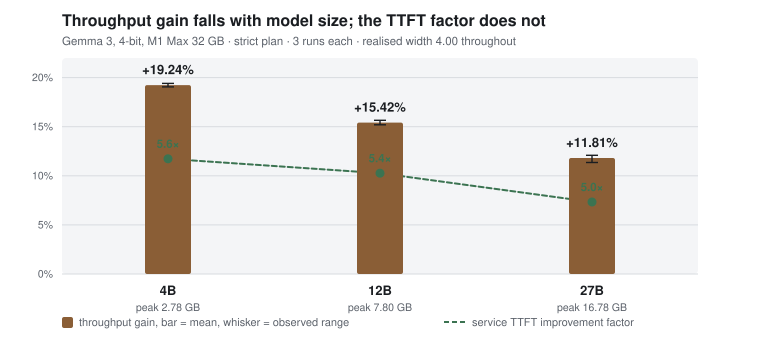

# How the grouped gain scales with model size

Measured 26 August 2026 on one machine. Exploratory: no preregistration was sealed
before these runs, so nothing here carries the standing of `E1`–`E16`. Recorded as
`X1` in [`research/LEDGER.md`](../research/LEDGER.md), raw data under `research/raw/X1_*`.

<picture>
  <source media="(prefers-color-scheme: dark)" srcset="assets/model-scaling-dark.svg">
  
</picture>

## What was measured

Strict plan, 6 requests, 48 max tokens, three runs per model, unchanged protocol.
No knob was touched between models.

| Model | throughput gain | observed range | spread | service TTFT | latency cost | peak |
| :-- | --: | :-- | --: | --: | --: | --: |
| Gemma 3 4B | `+19.24%` | 19.06 – 19.41 | `0.35pp` | `5.6x` | `+48.6%` | `2.78 GB` |
| Gemma 3 12B | `+15.42%` | 15.20 – 15.65 | `0.45pp` | `5.4x` | `+54.6%` | `7.80 GB` |
| Gemma 3 27B | `+11.81%` | 11.36 – 12.09 | `0.73pp` | `5.0x` | `+60.1%` | `16.78 GB` |

All three ran at a realised width of `4.00`, so group filling does not explain the
trend. The gaps between models, `3.82pp` and `3.61pp`, are five to ten times the
spread inside any one of them, and the observed ranges do not overlap.

**Two things move in opposite directions.** Throughput gain falls by roughly a third
from 4B to 27B. The service TTFT improvement barely moves: `5.6x`, `5.4x`, `5.0x`.
Whatever shrinks, it is not the queueing benefit.

The `reusable` plan is recorded but not interpreted. Its within-model spread reaches
`4.82pp` at 12B — as large as the differences it would be used to compare.

## Why this is the expected shape, and why that is not yet evidence

Grouped batch-1 never changes tensor shapes. It overlaps submission and
synchronisation across independent batch-1 steps; it does not make one weight load
serve several tokens. So it can only recover overhead that sits *around* the
arithmetic, never the weight traffic itself.

A 27B decode step moves roughly four times the weights of a 4B step for the same one
token. If the recoverable overhead is largely fixed per step, its share of a longer
step is smaller — which is the shape the table shows.

That reading is consistent with `E2` (a ~4.5 TFLOPS ceiling, `M=8` pathological) and
`E4` (achieved bandwidth rising from 104 to 324 GB/s as matrices grow from 1.4 to
360 MB). **It has not been measured here, and no claim is made from it.** It is
written down so the next experiment can try to refute it.

## What to test next

Ordered by how much the answer would change what IronMule does. Each carries what
would count as a negative result, because a plan that can only confirm is not a plan.

### 1. Is width 4 still the right ceiling at 27B?

The strongest candidate, and the cheapest to run.

`W=4` was fixed by `E2`, `E3` and `E14b` — **all three measured on 4B**. The
pathological `M=8` regime is a property of a matrix shape, and the shapes are not
close between these models:

| | hidden | intermediate | layers | kv heads |
| :-- | --: | --: | --: | --: |
| 4B | 2560 | 10240 | 34 | — |
| 12B | 3840 | 15360 | 48 | 8 |
| 27B | 5376 | 21504 | 62 | 16 |

`E4` already showed that larger matrices reach much higher achieved bandwidth. There
is no measurement saying `M=8` is pathological at 27B's shapes; it was assumed to
carry over.

**Test.** Sweep width 2, 4, 6, 8, 12 at 27B with the standard protocol, then repeat
the winner three times. Check token-identity at every width, not just throughput —
`E14b` found divergence at true batch 8, and correctness decides before speed does.

**Negative result.** Width 4 stays best at 27B too. Then the ceiling is a property of
the kernel rather than the shape, `LIMITS.md` gets a sentence saying it was checked
at two scales, and this line of work is closed.

### 2. Where does the recovered overhead actually go?

The explanation above is a story until someone instruments it.

**Test.** For one decode step at each model size, measure the time spent in
submission and synchronisation against total step time, sequential and grouped. If
the absolute recovered time per step is roughly constant across model sizes while the
step grows, the mechanism is confirmed and the falling percentage is arithmetic, not
a defect.

**Negative result.** Recovered time also falls in absolute terms. Then something in
the grouping path scales badly with model size and is worth fixing — a much more
interesting finding than the first one.

### 3. Does the fall belong to size or to Gemma?

4B, 12B and 27B are all Gemma 3. Size and family are fully confounded.

**Test.** One non-Gemma model near 12B — Qwen 2.5 14B or Llama 3.1 8B, 4-bit — under
the identical protocol. A single point that lands far off the Gemma line separates
the two explanations.

**Negative result.** It lands on the line. Then the trend is about size, which is the
more useful conclusion and the one worth preregistering.

### 4. Does a longer context change the balance?

Every measurement so far used 276–2048 tokens. Prefill is where the `5x` TTFT
advantage lives, and a longer prompt shifts weight toward prefill.

**Test.** The standard protocol at 4096 and 8192 context on 12B, then 27B if memory
allows. `LIMITS.md` already refuses capacity above 8192, so that is the hard edge.

**Negative result.** The gain is flat in context length. Then context stops being a
variable worth carrying in future designs.

### 5. Report the number a service actually feels

Not an experiment, a framing correction. At 27B the throughput gain is `+11.81%`
while the service TTFT improves `5.0x` and median latency worsens `+60.1%`. For an
interactive service the second number is usually the one that decides adoption, and
it is the one that survives scale.

This is only honest while all three keep being published together. Reporting the
`5.0x` and quietly dropping the `+11.81%` and the latency cost would be exactly the
selective reporting this project exists to avoid.

## What not to do

**Do not search configurations until a number looks better.** Sweeping width in test 1
is legitimate because there is a specific prior reason to expect the 4B ceiling not to
transfer, and the sweep reports every point. Re-running until a favourable draw appears
is not the same activity, and the spread here is small enough that it would be obvious.

**Do not promote `X1` to an `E` by editing it.** It has no preregistration and no
prespecified threshold. If the effect deserves that standing — and at this size it
probably does — it needs a fresh preregistration, a sealed threshold, and repeats
across separate OS processes, the way `E16` was run.

**Do not chase true tensor batching for this.** It would attack the weight traffic
rather than the overhead, so it is the mechanically right answer — but `E14b` measured
a reproducible token divergence at batch 8. Correctness first: that divergence needs
explaining before the performance is worth having.
