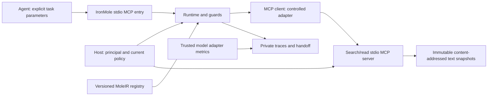

# Architecture and decisions

## Boundaries

No LLM, classifier, HTTP service, repository execution or mutable browser is in this
path. The MCP server is a local child process with no exposed listening port. The
outer approval only permits asking IronMole to attempt a task; every concrete inner
call independently passes host policy and adapter checks on both sides of MCP.

## Runtime sequence

1. Validate task shape and byte size; bind current host permissions and snapshot.
2. Select REFERENCE_PLAN when qualification is absent. An explicit host evaluation
   can execute optimized variants on isolated fixtures; agent arguments cannot.
3. Compile the closed DAG: schema/types, dependencies, acyclicity, semantic spine,
   adapter/effect availability, control guards and hard limits. Store the plan digest.
4. Execute lexical search, validate all returned matches/counts against the bounded
   input snapshot, derive line ranges, deduplicate/coalesce if the plan permits it,
   read with approved concurrency and validate bytes/checksums.
5. Canonically merge presentation intervals using the declared scan/indexed path, enforce the output envelope budget and
   produce a signed continuation when needed. Recheck current policy before return.
6. Persist redacted trace metadata. On failure stop scheduling, classify outcomes,
   retain still-valid evidence privately and return a structured handoff.

The semantic search guard rescans the small in-memory snapshot. This deliberate
cost is shared by C, reference and optimized paths. It lets fault tests detect
silent omission as well as malformed output. Scaling to large repositories requires
a separately justified integrity/coverage contract, not silently dropping this guard.

## Sources of truth and persistence

Executable types and validation live in `src/contracts.ts`. Generated draft-07 JSON
schemas are published in `schemas/`; drift tests compare them with their executable
source. `src/ir.ts` defines the allowed task graph; examples are serialized JSON.
`node:sqlite` holds immutable plan/snapshot rows and append-only metadata events.
Unknown SQLite schema versions fail closed; this is not an automatic migration system.
Operational plan lifecycle events do not alter Friday Evidence's study-bound schemas.

The registry key hashes all task/IR/adapter/contract/plan versions and operations.
Snapshots hash repository ID, path-ordered UTF-8 content and each file checksum.
Snapshot content is an input artifact, not a cached result of a previous task.
Tool-result caches are disabled. Within-run identical/overlapping reads may be removed
by the optimizer; a second task invokes tools again.

`friday_evidence.statistics` is reused for offline distributions and paired confidence
intervals. No frozen research package, evidence migration, MLX runtime or inference
qualification is imported, modified or copied. IronMole's operational store is scoped
to its own data; it is not presented as Friday Evidence qualification data.

## Strategy, mining and lifecycle

BYPASS reports an unsupported explicit task class. REFERENCE_PLAN is the known path.
OPTIMIZED_PLAN requires an active, identity-compatible candidate. RETURN_TO_AGENT
reports a failed execution assumption without restarting. POLICY_BLOCKED is a separate
terminal status and cannot select an alternative route around the denied operation.

The first miner groups normalized typed graphs within this task only, including
control/data dependencies and argument origins. It requires at least three valid
executions and two distinct parameter bindings. Parameters come from task fields and
validated search ranges; text similarity supplies no authority. Incomplete/passive
traces remain observations. This is template recognition and bounded variant proposal,
not general workflow induction or automatic semantic discovery.

Lifecycle: observed -> candidate -> validated -> active -> suspended. Validation and
activation use comparative, repository-held-out evidence. Passive observations may
suspend but cannot activate. Suspended plans need explicit revalidation. The manual
reference is known construction, labeled manual; it does not masquerade as mined.

The two objectives keep dimensions separate: latency under a USD cost cap, or cost
under a latency cap. The qualification calculation includes routing, guards, expected
successful execution, work spent before failure, handoff/agent continuation and
learning/validation amortized over the smaller of evidenced and requested future use
counts. Missing usage, price basis or continuation cost blocks qualification. Current
local evidence cannot supply these end-to-end quantities, so default dispatch stays
reference. Token counts are observations, never terms added to milliseconds or dollars.

## Threat model and limits

Repository contents and tool responses are data. They cannot edit host policy,
install adapters, execute code, choose a model, activate a plan or broaden resources.
The supported local host/account and its private policy/registry are trusted. This
prototype is not an OS sandbox against a malicious process running as the same user
and able to rewrite policy, Node code or SQLite. Snapshot import checks ancestor
symlinks, final-file no-follow opens, sizes and inode/mtime consistency; live concurrent
repository changes can make import fail. Snapshot execution itself is detached from
live filesystem paths.

Only the controlled adapter is supported. It limits responses before writing to MCP;
the client checks them again. The underlying SDK's stdio framing is not advertised as
a generic hostile-server memory sandbox. Untrusted third-party MCP processes are not
admitted. Model sampling, elicitation, arbitrary resources and dynamic tool catalogues
are unsupported. Cancellation asks the owned process to stop; it is not rollback.

Local retention grows with run count. Each run is bounded; there is no indefinite
background daemon, automatic cleanup of evidence or hidden upload. The user owns
retention/deletion of the private `.state/` and `bench/runs/` directories.
